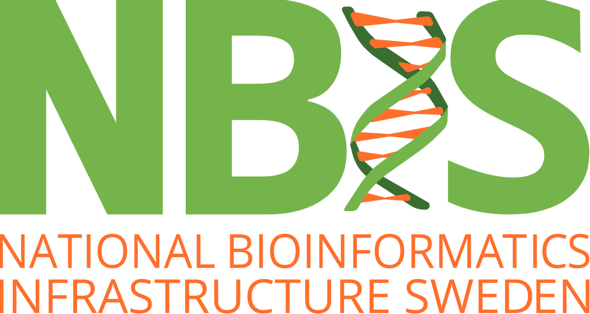
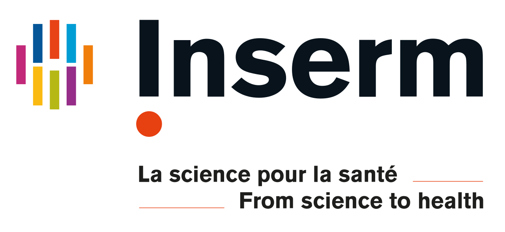
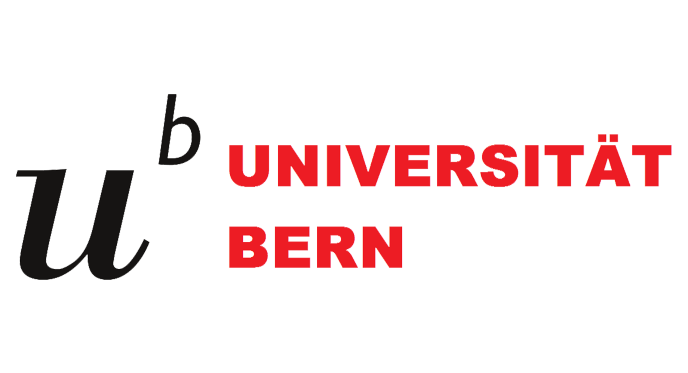
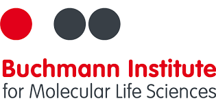
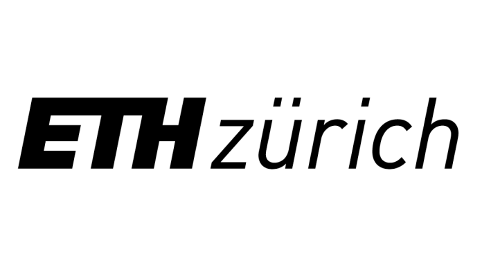

# Joint NCCR & SIB Summer School 2020 in
# Computational RNA Biology

23 - 28 August 2020 - Schwarzenberg (near Lucerne), Switzerland

 

Bioinformatics has always been a foundation for understanding RNA. This importance has only grown with the advent of next generation sequencing (NGS), as rapidly diversifying methods have been developed to study virtually all aspects of RNA, including expression, processing, structure and translation. While these techniques are based on a common foundation of NGS, each has unique aspects that remain within the realm of specialists. This presents a challenge for young researchers wishing to add these techniques to their skills toolkit.
The aim of this School is to broaden early-stage researchers’ expertise in RNA bioinformatics, with a particular focus on NGS-based analyses. Participants will gain an overview of the state-of-the-art in RNA bioinformatics, before embarking on a challenging, hands-on training project in a chosen area. Learning will be guided by experts from fields including single cell RNA analysis, long-read RNA sequencing, ribosome-profiling and UV cross-linking immunoprecipitation (CLIP-seq). There will be a focus on team-work and many opportunities for networking with trainers and other participants.

**Audience**
This course is aimed at early-stage researchers (PhD students, postdocs) in the RNA field. Given the course subject matter, only participants with working knowledge of scientific computing can be considered (see Requirements for further details).

 

##  Date

***

23.08.2020 - 28.08.2020

 

##  Location

***

Hotel & Bildungszentrum Matt, Schwarzenberg

Arrival: Sunday before 18h

Departure: Friday around 14h30

 

##  Programme

***

After a first day about RNA-seq overview, the remainder of the School will focus on group mini-projects.

We will work with 4 topics and there will be 2 groups of 4 participants for each topic. The groups will be composed in advance, based on a survey the applicants will complete. There will be about 2 tutors per project.

The last day, the groups will present their project.

For the full schedule, please go to: **[Schedule](schedule.md)**

 

##  Learning objectives

***

At the end of this school, the participants should be able to:
- have a good understanding of the most common methods of RNA-seq analysis,
- repeat the same type of analysis achieved during the mini-project,
- present the mini-project and more globally disseminate their experience to the members of their group.

**Pre-requisites - background knowledge**
- Previous experience with RNA-seq analysis
- Familiar with command line and UNIX language (link to a UNIX tutorial)
- Basic usage of R / Ability to use packages and modules and write analysis scripts in R

**Pre-requisites - material & software**
- The participants must bring a laptop with install permissions (admin). A list of software to be installed in advance will be communicated on due time.

 

##  Staff

***

**Coordination:**
- Norbert Polacek, UniBE, NCCR RNA & Disease Training & Education Delegate
- Dominik Theler, NCCR RNA & Disease Scientific Officer.
- Grégoire Rossier, SIB Training & PhD Training Network coordinator

**Scientific Committee:**
- Ana Marques, UNIL, NCCR RNA & Disease program delegate.
- Rory Johnson, UniBE, Head GoldLab (Genomics of Long noncoding RNA and Disease), NCCR RNA & Disease program delegate.
- Mihaela Zavolan, UNIBas/SIB, head or member of several WPs in the program.

**Lecturers:**
- Sarah Djebali, Institute of Health and Medical Research (INSERM), 🇫🇷 France
- Kathi Zarnack, Computational RNA Biology group, BLMS, 🇩🇪 Germany
- Melina Klostermann, Computational RNA Biology group, BLMS, 🇩🇪 Germany
- Paulo Czarnewski, National Bioinformatics Infrastructure (NBIS), 🇸🇪 Sweden
- Erik Fasterius, National Bioinformatics Infrastructure (NBIS), 🇸🇪 Sweden
- Sebastian Leidel, RNA Biochemistry group, UniBern, 🇨🇭 Switzerland
- Geert van Geest, Interfaculty Bioinformatics Unit, SIB/UniBern, 🇨🇭 Switzerland
- Giancarlo Russo, Functional Genomics Center, ETHZ/UniZH, 🇨🇭 Switzerland

**Contributing institutions:**

    
    
    
    

 

**Additional information**

Slack channel: https://join.slack.com/t/nccr-sib-rna/shared_invite/zt-fxti8aom-7oxC2~r6CPWHgv1Eb2_g3A

For more information, please contact <a href="mailto:gregoire.rossier@sib.swiss">Grégoire Rossier</a>.

 

 
