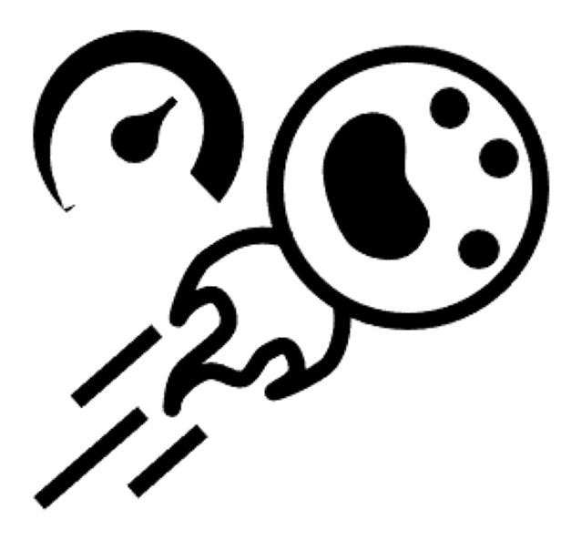
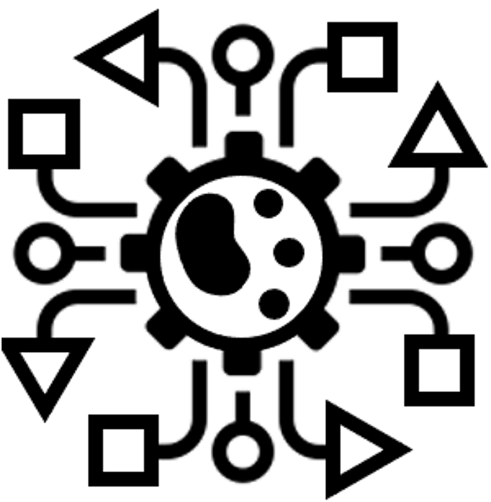

# Advanced topics in Single Cell Omics
Joint SciLifeLab-SIB Summer School

***

30.08.2021 - 03.09.2021 - ONLINE

 

In recent years, single-cell transcriptomics has become a widely used technology to study heterogeneous and dynamic biological systems. A large number of new tools and approaches have been developed for analyzing this new type of data.
The goal of this joint school is to provide PhD students and postdocs with theoretical and mostly hands-on knowledge on selected advanced topics in Single Cell analysis. In particular, the participants will be divided into small groups to develop mini projects. The following topics have been selected:

  <a href="/single-cell_sib_scilifelab_2021/project_spatial/README.html">
  

   
  Spatial transcriptomics
  

  </a>

  <a href="/single-cell_sib_scilifelab_2021/project_velocity/README.html">
  

   
  RNA velocity
  

  </a>

  <a href="/single-cell_sib_scilifelab_2021/project_omics/README.html">
  

   
  Omics integration
  

  </a>

  <a href="/single-cell_sib_scilifelab_2021/project_dnn/README.html">
  

   
  Deep learning
  

  </a>

 

**Audience**
This school is addressed to participants who are already familiar with the typical steps in single-cell (transcriptomics) analysis, which will not be covered during the event.

 

#  Date

***

30.08.2021 - 03.09.2021

 

#  Location

***

This course will take place ONLINE in accordance with the COVID-19 situation.

 

#  Programme

***

After a first day about RNA-seq overview, the remainder of the School will focus on group mini-projects.

We will work with 4 topics and there will be 2 groups of 4 participants for each topic. The groups will be composed in advance, based on a survey the applicants will complete. There will be about 2 tutors per project.

The last day, the groups will present their project.

For the full schedule, please go to: **[Schedule](schedule.md)**

 

#  Learning objectives

***

At the end of this school, the participants should be able to:
- have a good understanding of the most common methods of RNA-seq analysis,
- repeat the same type of analysis achieved during the mini-project,
- present the mini-project and more globally disseminate their experience to the members of their group.

**Pre-requisites - background knowledge**
- Previous intermediate experience with single cell RNA-seq analysis
- Familiar with command line and UNIX language
- Intermediate/advanced usage of R / Python

**Pre-requisites - material & software**
- The participants must use a laptop with install permissions (admin). A list of software to be installed in advance will be communicated on due time.

 

#  Staff

***

## Coordination:

- __*Jessica Lindvall*__, NBIS Training Coordinator, 🇸🇪 Sweden
- __*Grégoire Rossier*__, SIB Training & PhD Training Network coordinator, 🇨🇭 Switzerland

## Scientific Committee:

- __*Åsa Björklund*__, National Bioinformatics Infrastructure (NBIS), 🇸🇪 Sweden
- __*Paulo Czarnewski*__, National Bioinformatics Infrastructure (NBIS), 🇸🇪 Sweden
- __*Charlotte Soneson*__, Friedrich Miescher Institute, SIB/Basel, 🇨🇭 Switzerland
- __*Geert van Geest*__, Interfaculty Bioinformatics Unit, SIB/UniBern, 🇨🇭 Switzerland

## Invited Lecturers:

- __*Alma Andersson*__, KTH Royal Institute of Technology, Stockholm, 🇸🇪 Sweden
- __*Volker Bergen*__, Institute of Computational Biology, Munich, 🇩🇪 Germany
- __*Emma Dann*__, Wellcome Sanger Institute, Cambridge, 🇬🇧 United Kingdom
- __*Panagiotis Papasaikas*__, Friedrich Miescher Institute, SIB/Basel, 🇨🇭 Switzerland

 
 

**Additional information**

For more information, please contact [training@sib.swiss](mailto://training@sib.swiss).
