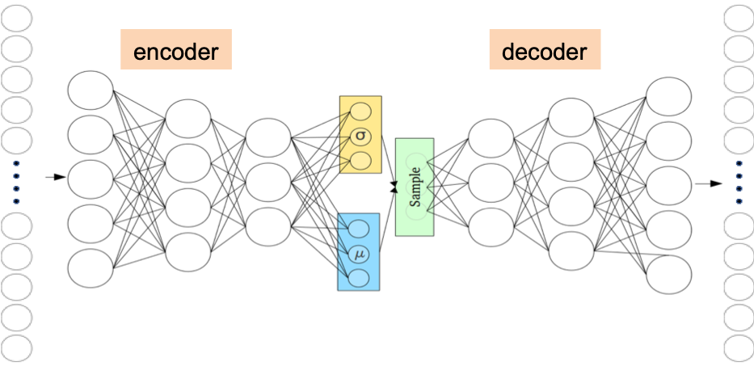
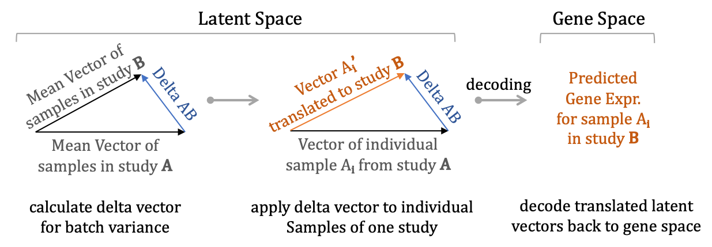
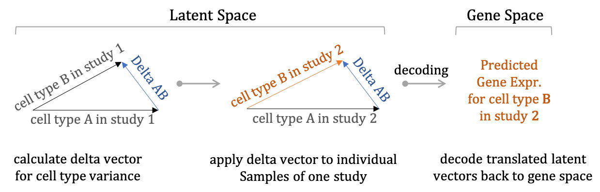

```{r setup, include=FALSE, class.source = "rchunk"}
knitr::opts_chunk$set(echo = TRUE, warning = FALSE, eval = TRUE)
options(width = 80)
```


```{r libload, eval=FALSE}
suppressPackageStartupMessages({
system("pipenv --python 3.8")
venv <- system("pipenv --venv", inter = TRUE)
reticulate::use_virtualenv(venv, required = TRUE)
library(tensorflow)
install_tensorflow(version= '2.2.0-gpu')
library(keras)
})
```


```{r libload2}
suppressPackageStartupMessages({
library(Matrix)
library(SingleCellExperiment)
library(Rtsne)
library(rsvd)
library(RColorBrewer)
library(scater)
library(ggplot2)
library(scran)
})
```


# Load the pre-processed dataset

For the group projects we will use data from the TabulaMuris compendium of single-cell mouse transcriptome data. The provided dataset is pre-filtered in terms of genes and cells so no additional pre-processing is required.

It contains data from two different technologies (attribute study: droplet/facs):

microfluidic droplet-based 3’-end counting: provides a survey of thousands of cells per organ at relatively low coverage and
FACS-based full length transcript analysis: provides higher sensitivity and coverage but at the expense of lower cell counts.
The provided cells are also annotated among others in terms of animal sex (attribute mouse_sex: F/M) and tissue of origin (attribute cell.class). There are 5 Tissues of origin:

Bladder, Limb_Muscle, Lung, Mammary_Gland and Thymus.
  
Features have also been preselected to include only those genes that are present and variable in all three datasets.
Next, we load the preprocessed dataset and have a first look at the 
composition of the dataset:


```{r Download}
## Download the data and set row names to gene symbols whenever possible
sce <- readRDS(gzcon(url("https://ppapasaikas.github.io/SC_datasets/Data/SCE_TabulaMuris_5Tissues_filtered.rds?raw=true")))
#Subsample cells to speed up processing and, most importantly, later-on model training:
#set.seed(42)
n=8000
sce <- sce[, sample(1:ncol(sce), n )  ]
## Dataset composition per cell type and study:  
table(colData(sce)$study , colData(sce)$cell.class)
```


Let's also take a look at a "standard" projection of the dataset  

```{r,  fig.width = 10, fig.height = 4,  warning=FALSE}
# We first normalize all cells for library size.
sce$library_size <- colSums(counts(sce))
assays(sce )[["lognorm"]] <- log2(sweep( counts(sce),2,sce$library_size ,FUN="/")*1e4 +1)
reducedDim(sce, "PCA" )  <- rsvd::rpca(t( assay(sce,"lognorm") ),k=32,retx=TRUE,center=TRUE,scale=FALSE)$x
reducedDim(sce, "TSNE" ) <- Rtsne( reducedDim(sce,"PCA"), perplexity = 30, initial_dims=32, pca=FALSE, theta=0.3)$Y #~5"-20" run time

cowplot::plot_grid(scater::plotTSNE(sce, colour_by = "study" ),
                   scater::plotTSNE(sce, colour_by = "cell.class"))
```


# Preparing the data for input.


We will split the data 80-20 to a training and validation set.

In addition, the input to the model has to be in the form of a 2D array with the samples in the rowsand features in the columns.

Of course in this case our 2D array is (also) a matrix. However in the general case where every sample is a feature vector of > *1D*
the data should be shaped as a multidimensional array with the samples in the 1st dimension.


## TASK 2.1
Build one single VAE model for the entire dataset.

- Group 1 remove all *female bladder cells from the facs data* 

- Group 2 remove all *mammary-gland data also from the facs data*. 

These will be used as a holdout test-set for out-of-sample inference using your model later on. 
Finally randomly split 80/20 your remaining data in training  (80%) and validation sets (20%).


```{r eval=FALSE}

combined.df.filtered <- as.matrix(assays(sce )[["lognorm"]] )  # You can instead use raw counts:
# combined.df.filtered <- as.matrix( counts(sce) )

# Group 1 remove all *female bladder cells* from the facs data* 
# idx.rem <- which(sce$study=="facs" & sce$cell.class=="Bladder" & sce$mouse_sex=="F")
# combined.df.filtered <- combined.df.filtered[,-idx.rem]

# Group 2 remove all *mammary-gland data* also from the facs data*. 
# idx.rem <- which(sce$study=="facs" & sce$cell.class=="Mammary_Gland")
# combined.df.filtered <- combined.df.filtered[,-idx.rem]
 
 
#These will be used as a holdout test-set for out-of-sample inference using your model later on. 
#Finally randomly split 80/20 your remaining data in training  (80%) and validation sets (20%).
 

####### Splitting in training and validation data, converting to array
set.seed(1)
holback.fraction=0.2
holdback.samples=sample(1:ncol(combined.df.filtered),round(holback.fraction*ncol(combined.df.filtered)) ) 

##### Training Data:
M=combined.df.filtered[,-holdback.samples]
sc_train_x=array(M, dim= c(dim(M)[1], prod(dim(M)[-1]))) # convert to an array
sc_train_x=t(sc_train_x)                                 #Need to transpose before passing to the model
rm(M)


##### Validation Data:
M=combined.df.filtered[,holdback.samples]
sc_test_x=array( M, dim= c(dim(M)[1], prod(dim(M)[-1]))) # convert to an array
sc_test_x=t(sc_test_x)                                   # Need to transpose before passing to the model
rm(M)
###################################################################
```


# Define the  variational autoencoder model

{ width=40% }

```{r eval=FALSE}
##### Sparse variational autoencoder model 
# Ensure compatibility with both TF2 nd TF1:
if (tensorflow::tf$executing_eagerly())
  tensorflow::tf$compat$v1$disable_eager_execution()

# Parameters --------------------------------------------------------------
neck <- 32L # Latent (bottleneck) dimension
drop_rate=0.2 #
gene_dim <- ncol(sc_train_x)  #Number of features (genes) in your dataset
latent_dim <- neck
epsilon_std <- 0.8  ##Standard deviation of the prior latent distribution (vanilla =1)
var_prior <- epsilon_std**2
log_var_prior <- log(var_prior)
kl_weight=0.1   #Weight for the Kulllback-Leibler divergence loss (vanilla =1 ) 

# Encoder definition  (using the functional API) :
x <- layer_input(shape = c(gene_dim),name="gene_input")
h <- layer_dense(x, 8 * neck, activation = "elu") 
h <- layer_dropout(h, rate = drop_rate)
h <- layer_dense(h, 4 * neck,activation="elu")
h <- layer_dropout(h, rate = drop_rate)
h <- layer_dense(h, 2 * neck, activation = "elu")
h <- layer_dropout(h, rate = drop_rate)
z_mean <- layer_dense(h, latent_dim)
z_log_var <- layer_dense(h, latent_dim)

#### Sampling from the latent space:
sampling <- function(arg){
    z_mean <- arg[, 1:(latent_dim)]
    z_log_var <- arg[, (latent_dim + 1):(2 * latent_dim)]
    epsilon <- K$random_normal(
        shape = c(K$shape(z_mean)[[1]]), 
        mean=0.,
        stddev=epsilon_std
    )
    z_mean + K$exp(z_log_var/2)*epsilon
}

# Lambda layer for variational sampling:
z <- layer_concatenate(list(z_mean, z_log_var)) %>% 
    layer_lambda(sampling)


# we instantiate the decoder separately so as to reuse it later
decoder_h <- keras_model_sequential()
decoder_h %>%
    layer_dense(units= 2 * neck,activation="elu") %>% #
    layer_dropout(rate = drop_rate) %>%
    layer_dense(units= 4 * neck,activation="elu") %>% 
    layer_dropout(rate = drop_rate) %>%
    layer_dense( 8 * neck, activation = "elu") %>%  
    layer_dropout(rate = drop_rate)

decoder_mean <- layer_dense(units = gene_dim, activation = "relu")
h_decoded <- decoder_h(z)
x_decoded_mean <- decoder_mean(h_decoded)

# end-to-end autoencoder (again notice the use of the functional API):
vae <- keras_model(x, x_decoded_mean)

# encoder, from inputs to latent space, also using the functional API:
encoder <- keras_model(x, z_mean)

# generator, from latent space to reconstructed inputs
decoder_input <- layer_input(shape = latent_dim)
h_decoded_2 <- decoder_h(decoder_input)
x_decoded_mean_2 <- decoder_mean(h_decoded_2)
generator <- keras_model(decoder_input, x_decoded_mean_2)

```


Next we define our loss function as well as any custom accuracy functions we wish to keep track of during training

```{r eval=FALSE}
vae_loss <- function(x, x_decoded_mean){
    reconstruction_loss  <-  loss_mean_squared_error(x, x_decoded_mean)
    kl_loss <- -kl_weight*0.5*K$mean(1 + z_log_var-log_var_prior - K$square(z_mean)/var_prior - K$exp(z_log_var)/var_prior, axis = -1L)  # More general formula
    reconstruction_loss + kl_loss
}


#### Custom correlation function to keep track of. 
#### Notice that all mathematical operation NEED to be performed using the Keras backend (e.g K$mean):
cor_metric <- function(y_true, y_pred) {  
    x = y_true
    y = y_pred
    xm = x-K$mean(x)
    ym = y-K$mean(y)
    r_num = K$sum(tf$multiply(xm,ym))
    r_den = K$sqrt(tf$multiply(K$sum(K$square(xm)), K$sum(K$square(ym))))
    r = r_num / r_den
    r = K$maximum(K$minimum(r, 1.0), -1.0)
    return (K$square(r))
}
```


# Model compilation
We are now going to compile the specified model. There are two required arguments that need to be specified 
for model compilation: The **loss function** and the **optimizer**.

Whereas the *loss function* specifies our training objective the *optimizer* specifies the specific algorithmic machinery
by which the parameters of the model will be updated. Almost all optimizers are variants of the *gradient descent* algorithm 
that tries to minimize a function (in this case our loss) by moving towards the steepest descent as this is estimated by the 
negative gradient.
Here we will use the `adam` optimizer, which belongs to the subfamily of "*adaptive moment estimation*"
optimizers. These optimizers are based on the intuition that not all parameters need to change with the same rate. One can use
the recent gradients to adjust learning rates of individual parameters in order to achieve faster convergence.  

For more details on the different optimizers option provided by keras you can check:
["keras optimizers"](https://keras.io/api/optimizers/adam/)

For more details on the adam optimizer see:
["adam optimization"](https://machinelearningmastery.com/adam-optimization-algorithm-for-deep-learning/)

```{r eval=FALSE}
#compiling the defined model with metric = accuracy and optimiser adam.
opt <-  optimizer_adam(lr =0.001,amsgrad = TRUE)# 
vae %>% compile(
  loss = vae_loss,
  optimizer = opt,
  metrics = custom_metric("cor",cor_metric)
)
```


# Model training (fitting)
In this next step we will fit the VAE model that we have compiled.

For training we will also use a scheduling program for the learning rate and make use of *callbacks* in order to enforce it.
This program will gradually increase *lr* for the first few tens of epochs (burn-in / warm-up).
This prevents the model weights from early overfitting in the very first stages of training. Once the model parameters are in-range it is safe to
increase the lr in order to accelerate training.
We will then reduce lr in a stepwise manner (lr drops) to refine model parameters.

In addition we will make use of an *early-stopping* callback in order to terminate training when no further progress is observed.


```{r eval=FALSE}
##### Learning rate scheduler: 
burn_in.nepochs <- 80 
burn_in_lr <- 2e-5  
batch_size <- 512 

 lr_schedule <- function(epoch, current_lr) {
   if (epoch <= burn_in.nepochs ) lr <- burn_in_lr
   else if (epoch < 450) lr <- min (2e-3, burn_in_lr + 1.5e-4 * ( (epoch-burn_in.nepochs)/20) )#Increase lr linearly up to 2e-3
   else if (epoch > 600 ) {lr <- 5e-6 } #Second LR drop  (Cool down)
   else {lr <- 1e-4} #First LR drop
   return(lr)
 }

lr_sch <- callback_learning_rate_scheduler(lr_schedule)

# Visualize the learnign rate schedule:
plot( 1:750, log10(  sapply (1:750, function(x) lr_schedule(x) ) ) 
          , type="l", col="darkslategray", xlab="epoch", ylab="log10(lr)", lwd=2, main="lr schedule")
text( c(40,480,680), c(-4.8,-4.2,-5.2),c("burn-in","1st lr drop","2nd lr drop") )


##### Early stopping callback:
early_stopping <- callback_early_stopping(monitor = "val_loss", min_delta = 0,
                                          patience = 125, verbose = 0, mode = "auto",
                                          baseline = NULL, restore_best_weights = TRUE)
```


```{r eval=FALSE}
nepochs=1000 #
######  Fit the model using also our specified callbacks for scheduling and early stopping:
history <- vae %>% fit(
    x=sc_train_x,
    y=sc_train_x, 
    shuffle = TRUE, 
    epochs = nepochs,
    batch_size = batch_size, 
    validation_data=list(sc_test_x,sc_test_x),
    callbacks = list(early_stopping, lr_sch )
    #callbacks = list(tnsrb, early_stopping, lr_sch )
)
#saveRDS(history, file="my_VAE_history.rds")
#filepath <- "my_VAE_weights.hdf5"
#save_model_weights_hdf5(vae, filepath)  
```


```{r eval=FALSE}
history <- readRDS("Data/my_VAE_history.rds")
plot(history)
```


## Task 2.2 

Experiment briefly with different architectural decisions and hyperparameters: Number of layers, layer width, dropout values, beta-parameter for the loss. How do these decision impact convergence time, accuracy of the imputed values, number of imputed drop-outs?


## Task 2.3
Once you have settled on one model architecture, train your model using your dataset using the 80-20 split between training and validation until full convergence. Show your training history. From this point on make certain your whole group works using the same fully trained model and corresponding set of weights.


## Task 2.4 Evaluate your model.

- 2.4.1 Compare library sizes and mean gene expression values in the input and the output (denoised) data.

- 2.4.2 Show the mean variance trend in the input and outpu (denoised) data


# Decoded output, latent representation and inference

We now have in our hands a trained VAE for our dataset. What is it good for? 

- The **decoded output** is a denoised version of our data. You can view the decoded output as a "cleaned-up" dataset where drop-outs have been imputed, outliers have been corrected for and measurement imperfections (including sampling variance) have been ironed out. As we will see, this has a dramatic effect on the **mean-variance profile** of our decoded dataset.

- The **latent output** is in itself a (highly non-linear) reduced dimension representation of our dataset. That means we can use it for visualization or to summarize specific subsets of our data.

- More importantly the latent representation is an estimation of the **manifold** that gives rise to our data. This allows us in principle to sample new observations from the complete area or specific regions of the manifold and to perform **inference**. For example we can "morph" cells from one type to another or even register and study all intermediate steps in this "morphing" process.


```{r fig.width=7, fig.height=7, eval=FALSE}
########################################################################################################  
vae %>% load_model_weights_hdf5("my_VAE_weights.hdf5")

palettes <- readRDS("Data/distinct_palettes.rds")

##### Run on the combined select dataset (train + validation):
study_annot <- sce$study
ct_annot <- sce$cell.class
combined.annot <- paste(sce$study,sce$cell.class,sep="_")

M <- combined.df.filtered
sc_x <- array(M, dim= c(dim(M)[1], prod(dim(M)[-1]))) # convert to an array
sc_x <- t(sc_x)                                       #Need to transpose before passing to the model
rm(M)

latent_output <- predict(encoder, list(gene_input=sc_x))
decoded_data <- predict( generator,  latent_output)

decoded_data.linear <- 2^decoded_data-1
sc_x.linear <- 2^sc_x-1

colsfact <- as.factor(sce$study)
mycols <- palettes[[nlevels(colsfact)]] 
cols <- mycols[colsfact]

### Several diagnostic plots:
par(mfrow=c(2,2))
plot(log2(rowSums(sc_x.linear)),log2(rowSums(decoded_data.linear)),pch=".",cex=2.5,col=cols,
     xlab="Model Input LogLibrarySize",ylab="Reconstructed LogLibrarySize",main="Library Size (Input vs Decoded)")
legend("topleft",bty ="n", text.col= mycols, legend=levels(colsfact))

plot(log2(colSums(counts(sce))),log2(rowSums(decoded_data.linear)),pch=".",cex=2.5,col=cols,
     xlab="Raw LogLibrarySize",ylab="Reconstructed LogLibrarySize",main="Library Size (Raw vs Decoded)")
legend("topleft",bty ="n", text.col= mycols, legend=levels(colsfact))

plot(colMeans(sc_x),colMeans(decoded_data),pch=".",cex=2,col="#5080B055",
     xlab="Input MeanLogCounts",ylab="Reconstructed MeanLogCounts",main="Collapsed Genes")

s=sample(1:nrow(sc_x),500)
mean.cor = mean(sapply(1:nrow(decoded_data[s,]),function(x) {cor(sc_x[x,],decoded_data[x,])}   ))

plot(as.vector((sc_x[s,])), as.vector((decoded_data[s,])),pch=".", cex=2,col="darkorange", #
     xlab="Input LogCounts",ylab="Reconstructed LogCounts",main="per-cell gene gounts")
text(1,7,paste("r=",round(mean.cor,3),sep=""))

```


We will now examine the **mean-variance** profile of the decoded output and compare it to the corresponding profile of the input data. 

```{r fig.width=8, fig.height=5, eval=FALSE}
############################### Mean Variance plots:  ############################### 
pc <- 0.001 #pseudocount
zeroes <- which(colSums(sc_x.linear) < quantile(colSums(sc_x.linear),0.01) )

mean_GE <- colMeans(sc_x.linear[,-zeroes] + pc )
gene_cv <- apply(sc_x.linear[,-zeroes], 2, function(x) sd(x+pc)/mean(x+pc ) ) 
mean_GE_decod <- colMeans(decoded_data.linear[,-zeroes] +pc )
gene_cv_decod <- apply(decoded_data.linear[,-zeroes], 2, function(x) sd(x+pc)/mean(x+pc ) ) 

#Log transform expression and cv:
X1 <- log2(mean_GE) 
Y1 <- log2(gene_cv+pc )
X1_decod <- log2(mean_GE_decod) 
Y1_decod <- log2(gene_cv_decod+pc  )
Y1_decod[Y1_decod < 1 & X1_decod < -7 ] <- 1

#linear fit of log(cv) as a function of log(gene expression):
use_t <- which(X1<quantile(X1,0.95) &  X1>quantile(X1,0.1))
use_d <- which(X1_decod<quantile(X1_decod,0.95) &  X1_decod>quantile(X1_decod,0.1))
m <- lm(Y1[use_t] ~ X1[use_t])
m_decod <- lm(Y1_decod[use_d] ~ X1_decod[use_d])

#Loess Fit of log(cv) as a function of log(gene expression):
loess <- loess(Y1[use_t] ~ X1[use_t],control=loess.control(surface="direct"),span=0.5, degree=1)
loess_decod <- loess(Y1_decod[use_d] ~ X1_decod[use_d],control=loess.control(surface="direct"),span=0.5, degree=1)
xvar <- seq( min(X1)+0.5, max(X1)-2.5,0.5   )
sm <- predict(loess,xvar)
sm_decod <- predict(loess_decod,xvar)

par(mfrow=c(1,2))
xlim=c(-3,7)
ylim=c(-1.5,3)

##scatterplot of log(cv) as a function of log(mean expression):
plot(X1,Y1,xlab="log2(mean gene expression)",ylab="log2(coefficent of variation)" ,main="mean-variance trend actual",pch=19,col="#5080B055",cex=0.7,xlim=xlim,ylim=ylim )
lines(sm,x= xvar,col="darkred",lty=2,lwd=2) # Loess fit
abline(0,-0.5,col="darkgrey",lwd=2,lty=2) # Slope in m-v trend according to poisson distribution:
legend("topright",legend = c("poisson","loess.fit"),lty=2,lwd=2,bty="n",col=c("darkgrey","darkred"))

plot(X1_decod,Y1_decod,xlab="log2(mean gene expression)",ylab="log2(coefficent of variation)" ,main="mean-variance trend denoised",pch=19,col="#5080B055",cex=0.7,xlim=xlim,ylim=ylim  )
lines(sm_decod,x= xvar,col="darkred",lty=2,lwd=2) # Loess fit
abline(0,-0.5,col="darkgrey",lwd=2,lty=2) # Slope in m-v trend according to poisson distribution:
legend("topright",legend = c("poisson","loess.fit"),lty=2,lwd=2,bty="n",col=c("darkgrey","darkred"))

```


## Task 2.5

Using and interpreting the latent space

2.5.1 Use you model's latent space to produce a tSNE visualization of your data. How does it compare to the tSNE visualization produced using as input PCs?

2.5.2 Color you projection according to the cell values of (a few) different latent nodes.

2.5.3 Which are the top genes affected in the denoised output when perturbing the values of individual latent nodes? Do they make sense in terms of which cell-types have higher loadings for those particular latent nodes?


## Task 2.6 Inference task 1: Dropout-imputation and outlier correction (denoising).

2.6.1 Group 1: Corrupt a random subset of your input data by droupouts (zeroes). Impute the corrupted values using your model. How do they compare between FACS and Droplet data? How do they compare when you repeat the same task in the validation or hold-out datasets? Produce scatterplots to compare initial observed values vs corrupt values and initial observed values vs denoised values.

2.6.2 Group 2: Corrupt a random subset of your input data using large-magnitude outliers. Select genes with non-zero observed counts and force a 2-4x fold change in the observed counts in either direction. How do they compare between FACS and Droplet data? How do they compare when you repeat the same task in the validation or hold-out datasets? Produce scatterplots to compare initial observed values vs corrupt values and initial observed values vs denoised values.


## Task 2.7 Inference task 2: Batch correction using latent arithmetic.

Here we will show a first example of using our learned latent space for inference. Specifically we will correct for batch-specific
effects by decomposing the variance in the latent space:

{ width=50% }

```{r fig.width=10, fig.height=7, eval=FALSE}
########## Latent arithmetic operations to correct for batch :
# For each batch calculate the mean latent vector. Apply lv arithmetic to move all batches to an arbitrary (e.g most populous) reference batch
ref_batch <- names(which.max(table(study_annot))) # Set as reference batch the most populous study
idx_ref <- which(study_annot == ref_batch)

latent_output_bc <- latent_output
batch_lv  <- list()
Delta_lv <- matrix(0,nrow = length(unique(study_annot)), ncol=ncol(latent_output) )
rownames(Delta_lv) <- unique(study_annot)
batch_lv[[ref_batch]] <- colMeans(latent_output[idx_ref ,])   

for (b in setdiff( unique(study_annot),ref_batch )  ) {
idx <- which(study_annot == b)
batch_lv[[b]] <- colMeans(latent_output[idx,])   # Calculate mean latent vectors for the batch
Delta_lv[b, ] <- batch_lv[[b]] - batch_lv[[ref_batch]]  # Calculate batch lv delta from reference batch
latent_output_bc[idx,] <- sweep(latent_output_bc[idx,], 2, Delta_lv[b, ]   ) # Create a new latent output  that is corrected for batch
}

decoded_data_bc <- predict( generator,  latent_output_bc  ) #New decoded data that are corrected for batch


########### Cell projections ###########
annot <- study_annot
annot <- paste0(ct_annot,"_",study_annot) # 


#reducedDim(sce, "PCA_decod" )  <- rpca(decoded_data, k=32, retx=TRUE, center=TRUE, scale=FALSE)$x
#reducedDim(sce, "PCA_decod_bc" ) <- rpca(decoded_data_bc ,k=32, retx=TRUE, center=TRUE, scale=FALSE)$x
reducedDim(sce, "vae_latent" ) <- latent_output
reducedDim(sce, "vae_latent_bc" ) <- latent_output_bc


#reducedDim(sce, "TSNE_PCA_decod" ) <- Rtsne(  reducedDim(sce,"PCA_decod"), perplexity = 30, initial_dims=32, pca=FALSE, num_threads =8, theta=0.3)$Y
#reducedDim(sce, "TSNE_PCA_decod_bc" ) <- Rtsne(reducedDim(sce,"PCA_decod_bc"), perplexity = 30, initial_dims=32, pca=FALSE, num_threads =8,   theta=0.3)$Y
reducedDim(sce, "TSNE_vae_latent" ) <- Rtsne( reducedDim(sce,"vae_latent"), perplexity = 30, initial_dims=32, pca=FALSE, num_threads=8,   theta=0.3)$Y
reducedDim(sce, "TSNE_vae_latent_bc" ) <- Rtsne( reducedDim(sce,"vae_latent_bc"), perplexity = 30, initial_dims=32, pca=FALSE, num_threads=8,  theta=0.3)$Y


############ PLOTTING
#palette <- c("DarkSalmon","IndianRed","Firebrick","LightSteelBlue","CornFlowerBlue","SteelBlue","Burlywood","Peru","Sienna")
#names(palette) <- names( table( annot )  )
#cols <- palette[  annot  ]

TSNEin <- reducedDim(sce,"TSNE")
#TSNEdc <- reducedDim(sce,"TSNE_PCA_decod")
#TSNEdc_bc <- reducedDim(sce,"TSNE_PCA_decod_bc")
TSNElv <- reducedDim(sce,"TSNE_vae_latent")
TSNElv_bc <- reducedDim(sce,"TSNE_vae_latent_bc")


par(mfrow=c(2,2))
plot(TSNEin[,1],TSNEin[,2],pch=19,col=cols,xlab="TSNE1",ylab="TSNE2",cex=0.7,main="TSNE input")
#plot(TSNEdc[,1],TSNEdc[,2],pch=19,col=cols,xlab="TSNE1",ylab="TSNE2",cex=0.7,main="TSNE decoded")
plot(TSNElv[,1],TSNElv[,2],pch=19,col=cols,xlab="TSNE1",ylab="TSNE2",cex=0.7,main="TSNE latent vars")
plot(TSNElv_bc[,1],TSNElv_bc[,2],pch=19,col=cols,xlab="TSNE1",ylab="TSNE2",cex=0.7,main="TSNE lat. vars bc")
#plot(TSNEdc_bc[,1],TSNElv_bc[,2],pch=19,col=cols,xlab="TSNE1",ylab="TSNE2",cex=0.7,main="TSNE decoded bc")
plot.new()
legend("left",bty ="n", pch=19, col= palette, legend=names(palette) , ncol=2,cex=1 , text.width=0.4)
```


  
## Task 2.8  Out-of-sample prediction using latent arithmetic.

In this final task you will be asked to use your model to infer location characteristics for the distributions of cells held-out during model construction. Note that there are a few way to go about each prediction task.

- 2.8.1 Group 1: Predict the mean gene expression of female bladder cells of facs data by:

Starting from male bladder facs cells and adding a gender-delta latent vector, also calculated from facs data.

Starting from female bladder cells of droplet data and adding a technology-delta latent vector.


- 2.8.1 Group 2: Predict the mean gene expression of mammary-gland of facs data by:

Starting from droplet mammary-gland cells and adding a technology-delta latent vector.

Starting from (non-mammary-gland) facs cells and adding mammary-gland delta latent vector calculated using the droplet data.

VERY IMPORTANT for all inference tasks in 2.7 and 2.8: Remember for all calculations of mean latent vectors to use balanced samples in terms of their composition for uninteresting (known) sources of variance. For example when calculating a technology-delta latent vector, the two sets of cells used for the calculation of the average facs and average droplet latent vectors should be balanced in terms of tissue AND mouse gender.

{ width=50% }

```{r fig.width=9, fig.height=3, eval=FALSE}

########## Latent arithmetic operations for out-of-sample prediction :

#Deltas:

#Shift latent vector of wal cell types in the luminal progenitor direction:

#Take the average of the two predictions and decode:  

```