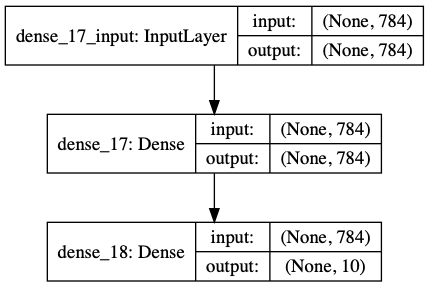

```{r setup, include=FALSE, class.source = "rchunk"}
knitr::opts_chunk$set(echo = TRUE, warning = FALSE, eval = TRUE)
options(width = 80)
```


# Summary
Here we will demonstrate the implementation of a simple Multilayer Perceptron (MLP) model with both R and Python `keras` including **model definition**, **compilation** and **training**.

Finally we will quickly contrast the **sequential** vs the **functional** `keras` APIs for model definition.


# Keras installation in R
For extensive documentation on the R `keras` installation see:
["Install Keras and the TensorFlow backend"](https://tensorflow.rstudio.com/reference/keras/install_keras/)


  
  
  
# Mutilayer Percetron model for MNIST digit classification  using the **R** `keras`  


At this point all our **R** and `keras` package requirements are in place so we are ready to build a first `keras` model!
First we need to load the `keras` library:

```{r libload, eval=FALSE}
suppressPackageStartupMessages({
system("pipenv --python 3.8")
venv <- system("pipenv --venv", inter = TRUE)
reticulate::use_virtualenv(venv, required = TRUE)
library(tensorflow)
install_tensorflow(version= '2.2.0-gpu')
library(keras)
})
```

```{r, include=FALSE}
#Specific setup for xenon6 execution :
reticulate::use_virtualenv("/tungstenfs/groups/gbioinfo/sharedSoft/virtualenvs/r-4.1-bioc-3.13-reticulate-keras-2.4.0-tensorflow-2.4.0-gpu/")

Sys.setenv("CUDA_VISIBLE_DEVICES" = "1" ) # Define visible  GPU devices
ngpus=length(strsplit(Sys.getenv("CUDA_VISIBLE_DEVICES"),",")[[1]])
reticulate::py_config()
library(keras)
K <- backend() # manual add-on
library(tensorflow)
tf$version$VERSION
library(ggplot2)
library(gridExtra)

#Check device usage:
tf$compat$v1$Session( config=tf$compat$v1$ConfigProto(log_device_placement=TRUE)  )
tf$compat$v1$keras$backend$get_session()


```


## Preparing the data:

```{r MLP}
#loading the keras inbuilt mnist dataset
data<-dataset_mnist()

#separating train and test file
train_x<-data$train$x
train_y<-data$train$y
test_x<-data$test$x
test_y<-data$test$y

rm(data)

# flattening the 2D featuresinto 1D for feeding into the MLP and normalizing the matrix
train_x <- array(train_x, dim = c(dim(train_x)[1], prod(dim(train_x)[-1]))) / 255
test_x <- array(test_x, dim = c(dim(test_x)[1], prod(dim(test_x)[-1]))) / 255

#converting the target variable to one hot encoded vectors using a keras inbuilt function
train_y <- to_categorical(train_y,10)
test_y <- to_categorical(test_y,10)
```


## Model definition

The sequential model is a linear stack of layers.
You create a sequential model by calling the `keras_model_sequential()` function and then a series of layer functions.

Each layer also needs to know what input shape it should expect. For this reason, the first layer in a sequential model (and only the first, because following layers can do automatic shape inference) needs to receive information about its input shape.
As illustrated in the example below, this is done by passing an input_shape argument to the first layer. 

```{r}
#defining a keras sequential model
model <- keras_model_sequential()

#defining the model with 1 input layer[784 neurons], 1 hidden layer[784 neurons] with dropout rate 0.4 and 1 output layer [10 neurons]
#i.e digits from 0 to 9
model %>%
layer_dense(units = 784, input_shape = 784, activation = 'relu') %>%
layer_dropout(rate=0.4) %>%
layer_dense(units = 10,activation = 'softmax')

summary(model)
```



## Compilation
We are now going to compile the specified model. There are two required arguments that need to be specified 
for model compilation: The **loss function** and the **optimizer**. 

Whereas the *loss function* specifies our training objective the *optimizer* specifies the specific algorithmic machinery

During compilation we can also specify other (built-in or custom) function *metrics* we wish to keep track of during training.

```{r}
#compiling the defined model with metric 'accuracy' and optimiser 'adam'
model %>% compile(
loss = 'categorical_crossentropy',
optimizer = 'adam',
metrics = c('accuracy')
)
```

## Training
Training is typically done with the fit function.  Fit has a few required arguments:
The (compiled) model to be trained, the training and target data.
Other important (optional) arguments for fit is the number of training epochs, the batch size a list of validation data as well as a list of callbacks (objects that perform different actions at various steps of training ).
We will familiarize ourselves with several of these `fit` arguments in the second, more extensive, exercise.

```{r}
#fitting the model on the training dataset
history <- model %>% fit(train_x, train_y, epochs = 50, batch_size = 3000, validation_data=list(test_x,test_y))
plot(history)
```


  
  
  

# Mutilayer Percetron model for MNIST digit classification  using the **Python** `keras`  

We now demonstrate the implementation of the exact same model in **Python** `keras`.
As you will see everything from model definition to compilation and training looks extremely similar.

```{python, class.source="pythonchunk", eval=FALSE}
#importing the required libraries for the MLP model
import keras
from keras.models import Sequential
import numpy as np


#loading the MNIST dataset from keras
from keras.datasets import mnist
(x_train, y_train), (x_test, y_test) = mnist.load_data()

#reshaping the x_train, y_train, x_test and y_test to conform to MLP input and output dimensions
x_train=np.reshape(x_train,(x_train.shape[0],-1))/255
x_test=np.reshape(x_test,(x_test.shape[0],-1))/255

import pandas as pd
y_train=pd.get_dummies(y_train)
y_test=pd.get_dummies(y_test)

#performing one-hot encoding on target variables for train and test
y_train=np.array(y_train)
y_test=np.array(y_test)

#defining model with one input layer[784 neurons], 1 hidden layer[784 neurons] with dropout rate 0.4 and 1 output layer [10 #neurons]
model=Sequential()

from keras.layers import Dense
model.add(Dense(784, input_dim=784, activation='relu'))
keras.layers.core.Dropout(rate=0.4)
model.add(Dense(10,input_dim=784,activation='softmax'))

#compiling the defined model with metric 'accuracy' and optimiser 'adam'
model.compile(loss='categorical_crossentropy', optimizer="adam", metrics=['accuracy'])
# fitting model and performing validation

history=model.fit(x_train,y_train,epochs=50,batch_size=1024,validation_data=(x_test,y_test), verbose=0)

import matplotlib.pyplot as plt
# summarize history for accuracy
plt.plot(history.history['accuracy'])
plt.plot(history.history['val_accuracy'])
plt.title('model accuracy')
plt.ylabel('accuracy')
plt.xlabel('epoch')
plt.legend(['train', 'test'], loc='upper left')
plt.show()
# summarize history for loss
plt.clf()
plt.plot(history.history['loss'])
plt.plot(history.history['val_loss'])
plt.title('model loss')
plt.ylabel('loss')
plt.xlabel('epoch')
plt.legend(['train', 'test'], loc='upper left')
plt.show()
```


Plotting the model:
```{python, class.source="pythonchunk", eval=FALSE}
import keras
import pydotplus
from keras.utils.vis_utils import model_to_dot
keras.utils.vis_utils.pydot = pydot
keras.utils.plot_model(
   model,
   #to_file="DGNs/figures/MLP_model.png",
   show_shapes=True,
   show_layer_names=True,
   rankdir="TB",
   expand_nested=False,
   dpi=96 )
```


  
  
#  Functional API

The `Keras` functional API is a more flexible/modular way for mode definition which makes it more appropriate for more complex models with non-linear topology such as multi-input/output models or models with shared layers.

Remember that the three key objects of the `Keras`API (but also of the underlying backends such as `Tensorflow`) are *Tensors*, *Layers* and *Models* .
The main idea that a deep learning *model* is usually a directed acyclic graph (DAG) of *layers* connected by *tensor* edges.

The functional API is a more explicit way to construct this DAG by specifying the *layers* nodes of the graph that perform operations
on the *tensors* that "flow" through the graph's edges --> *Tensor*-*flow*! 😊.

This modular specification of the DAG design is exactly what makes it so flexible.


Let's see how we would define the previous MLP model using the Functional API:

```{r}
# input layer
inputs <- layer_input(shape = c(784))
#The inputs tensor that is returned contains information about the shape and dtype of the input data that you feed to your model. Here's the shape and dtype: 
inputs

# We now create new nodes in the graph of layers by calling a layer on this inputs object:
predictions <- inputs %>%
  layer_dense(units = 784, activation = 'relu') %>% 
  layer_dropout(rate=0.4) %>% 
  layer_dense(units = 10, activation = 'softmax')

# Until this point we have not instantiated a model. We have just specified a graph.

# Now we instantiate the model by specifying its inputs and outputs in the graph of layers
model_f <- keras_model(inputs = inputs, outputs = predictions)

summary(model_f)
```


With the functional API, it is easy to reuse trained models: you can treat any model as if it were a subgraph that you can reuse
as a building block of another model.
Note that you aren’t just reusing the architecture of the model, you are also reusing its weights.


  
  
# Useful links
  
**General tutorials and collection of examples models:**

- https://towardsdatascience.com/introduction-to-deep-learning-with-keras-17c09e4f0eb2

- https://keras.rstudio.com/articles/

- https://tensorflow.rstudio.com/guide/keras/examples/


  
  
**Articles on the functional API:**

- https://keras.io/guides/functional_api/

- https://keras.rstudio.com/articles/functional_api.html

- https://www.perfectlyrandom.org/2019/06/24/a-guide-to-keras-functional-api/

