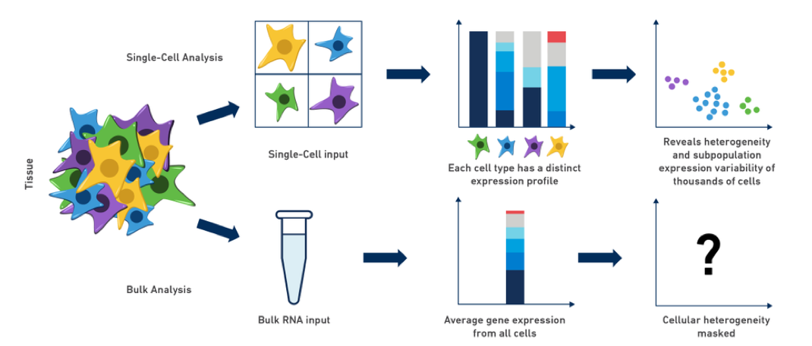
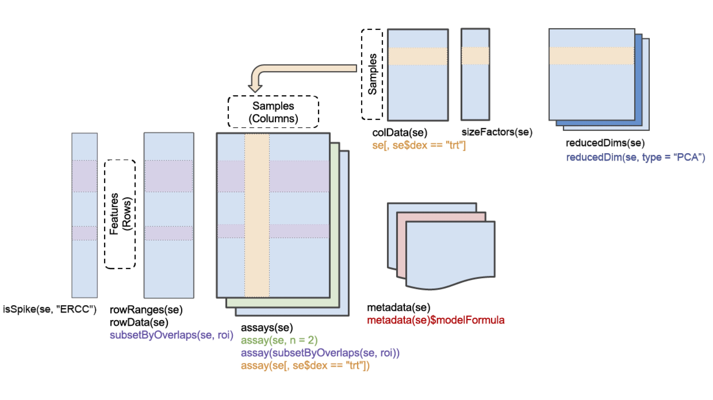
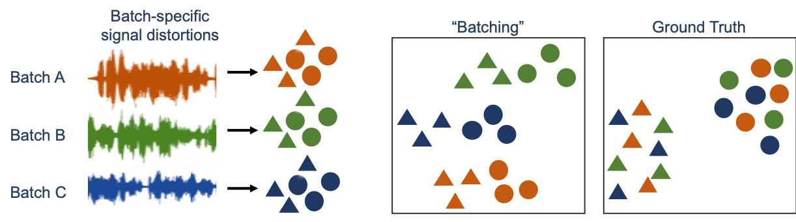
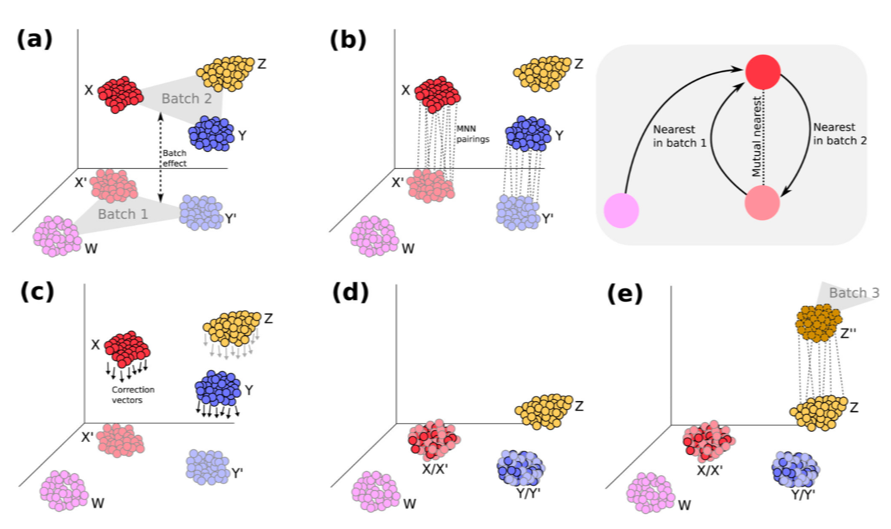
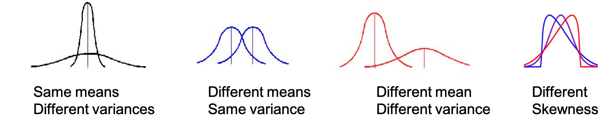

```{r style, echo = FALSE, results = 'hide', message=FALSE, warning=FALSE, cache=FALSE, purl=FALSE}
## Packages required for formatting
suppressPackageStartupMessages({
  library(knitr)
  library(png)
  library(grid)
  library(BiocStyle)
})
## Bioc style for markdown
BiocStyle::markdown()

## Set different chunk options for different output formats
 
  fig.scale <- 1
  fig.width <- 10
  fig.height <- 7


## default chunk options
opts_chunk$set(tidy = FALSE, cache = FALSE, 
               tidy.opts = list(blank = FALSE, width.cutoff = 120),
               fig.width = fig.width, fig.height = fig.height)
## text width in chunks
options(width = 70)

evalSolution <- TRUE
```


## Load required libraries
```{r}
suppressPackageStartupMessages({
  library(SingleCellExperiment)
  library(scater)
  library(ggplot2)
  library(scran)
  library(batchelor)
  library(BiocSingular)
  #library(BiocNeighbors)
  library(Rtsne)
  library(rsvd)
  library(tidyr) 
  library(dplyr)
  #library(igraph)
})
```


# Why single-cell assays?

* Limited input material (e.g early development, circulating tumor cells, ...)
* Sample heterogeneity (mixture of cell types / states) 
  + Number and frequency of cell populations
  + Markers for cell populations
  + Variability of gene expression among cells
  + Cell population relationships (developmental/pseudo-temporal ordering)
  + Discriminate between changes in overall (bulk) gene expression due to changes in cell type composition, and changes due to changes in expression levels within a given cell type

```{r, echo=FALSE, out.width = "1000px"}

```
(Image credit: 10x Genomics: Getting started with single cell gene expression)

# Generating scRNA-seq data

* Single-cell sequencing is still a relatively new technology, and as a consequence, there is not yet a real de facto standard for the library generation.
* Currently, the most common classes of protocols are 
  + low-throughput, plate-based, full transcript coverage, with high sequencing depth (e.g., Smart-Seq2)
  + high-throughput, droplet-based, 3' biased, with low sequencing depth (e.g., 10x Genomics Chromium)
* We will not go through the different protocols in detail, but if you want to read more, see e.g. 
  + [Mereu et al. 2020](https://www.nature.com/articles/s41587-020-0469-4?draft=marketing)
  + [Ding et al. 2020](https://www.nature.com/articles/s41587-020-0465-8)
* Which protocol to choose for a given application depends on the goal of the study. 
  + Plate-based: many detected genes per cell, fewer cells, isoform analysis (perhaps) possible, possibility of knowing the identity/origin of a specific cell
  + Droplet-based: fewer detected genes per cell (mostly the highly expressed ones), many cells

## Unique molecular identifiers

* Because of the small amount of input material, strong amplification is required during library preparation
* By attaching a tag to each original transcript molecule, before the amplification, reads generated from the same molecule can be identified and collapsed at the quantification step
* These tags are called _unique molecular identifiers_ (UMIs), and are part of many of the single-cell sequencing protocols (in particular the droplet-based ones)

## Example read structure (10x Genomics Chromium v3)


(Image credit: 10x Genomics)

* The _sample index_ identifies the library (in case of multiplexing)
* The _10x barcode_ (or cell index) identifies the cell within the library
* The _UMI_ identifies the transcript molecule within a cell and gene
* The _insert_ is the actual cDNA sequence

You typically receive three fastq files per sample from the sequencing facility:

* **sample**_I1.fastq.gz: contains sample index
* **sample**_R1.fastq.gz: contains 10x barcode + UMI
* **sample**_R2.fastq.gz: contains insert sequence

Data from plate-based protocols such as Smart-Seq2 are more similar to bulk data, and you typically get one fastq file per cell.


# Representation of scRNA-seq data

* We have seen how bulk RNA-seq data is often represented in a [`SummarizedExperiment`](https://bioconductor.org/packages/SummarizedExperiment/) object (at least within the Bioconductor framework)
* Single-cell RNA-seq has a similar structure (a count matrix, with genes as rows and cells as columns), and is represented in a [`SingleCellExperiment`](https://bioconductor.org/packages/SingleCellExperiment/) object
* The `SingleCellExperiment` object is an extension of the `SummarizedExperiment` object
* The main difference is that a `SingleCellExperiment` object can also store reduced dimension representations (PCA, tSNE, UMAP)


(Original image credit: Jim Hester / https://bioconductor.org/packages/release/bioc/vignettes/SummarizedExperiment/inst/doc/SummarizedExperiment.html)

# Example data

# Load the  dataset

The dataset that we will use is a composite dataset of three independent
10x runs originating from three different labs. It consists of mammary 
epithelial cells, sequenced using 10x Genomics technology, which has already
been pre-filtered to include only cells that are assigned unambiguously
to one of three major  cell types:
luminal progenitors, luminal mature and basal.


Next, we load the preprocessed dataset and have a first look at the 
composition of the dataset:

```{r, message = FALSE, warning = FALSE}
## Download the data and set row names to gene symbols whenever possible
sce <- readRDS(gzcon(url("https://ppapasaikas.github.io/SC_datasets/Data/SCE_MammaryGland_prefiltered.rds?raw=true")))
rownames(sce) <- scater::uniquifyFeatureNames(
  ID = rownames(sce), 
  names = as.character(rowData(sce)$gene.symbols)
)
#Subsample cells to speed up processing:
set.seed(42)
n=3000
sce <- sce[, sample(1:ncol(sce), n )  ]
## Dataset compostion per cell type and study:  
table(colData(sce)$study , colData(sce)$cell.class)
```


We can see that `sce` is indeed a `SingleCellExperiment` object.

```{r}
sce
```

Accessing the assay data, row and column annotations is done in the same way as for `SummarizedExperiment` objects. There is also an additional `counts()` accessor for the `counts` assay.

******

Check that the `counts()` accessor returns the same matrix as you would get 
if you access the counts assay using `assay()` or `assays()`. 

```{r, message = FALSE, echo = evalSolution, eval = evalSolution}
identical(assay(sce, "counts"), counts(sce))
all(assay(sce, "counts") == counts(sce))   ## alternative
identical(assays(sce)[["counts"]], counts(sce))
```

******

How many genes are quantified in this experiment? What is the exact number of 
cells in the object?

```{r, message = FALSE, echo = evalSolution, eval = evalSolution}
dim(sce)
```

******

While the structure of the scRNAseq data is similar to that of the bulk data, there are also important differences that affect the downstream analysis. One of these differences is that single-cell data is much more _sparse_; in other words, there are many more zeros in the count matrix from a single-cell experiment than from a bulk experiment. This is due to things such as:

* the much lower sequencing depth per cell/sample (especially for droplet-based protocols)
* not every individual cell expressing each gene
* a failure of the library preparation to capture many of the expressed transcript molecules

Let's check the fraction of zeros in our count matrix:

```{r}
mean(counts(sce) == 0)
```

We also calculate the range of library sizes, noting that these are much smaller than the typical values for bulk RNA-seq:

```{r}
summary(colSums(counts(sce)))
```

The number of cells in a scRNA-seq data set is typically much (several orders of magnitude) larger than the number of samples in a bulk RNA-seq experiment. Hence, the count matrices can get very large. However, since most of the values are zero, efficient storage modes, where only the non-zero values and the corresponding matrix positions are stored, can be employed. We can make sure that the count matrix in our object is indeed such a _sparse_ matrix (in this particular data set, it is actually provided as a [`DelayedMatrix`](http://www.bioconductor.org/packages/DelayedArray/), which is beyond the scope of this course to discuss in detail, but which can be suitable for very large data matrices that do not fit in memory). 

```{r}
class(counts(sce))
counts(sce) <- as(counts(sce), "dgCMatrix")
class(counts(sce))
counts(sce)[1:10, 1:10]
```

# Properties of scRNA-seq data and quality control

We already noted a couple of differences between scRNA-seq data and bulk data: the former typically contains many more observations, and the count matrix is much more sparse. The low amount of starting material for scRNA-seq experiments also results in a high sampling noise, and a lower correlation among cells than among bulk RNA-seq samples. This can be seen in a scatter plot of the observed counts for two randomly selected cells in our example data set:

```{r}
## Scatter plot of two sparse cells with similar library sizes
idx <- order(abs(colSums(counts(sce)) - 
                   median(colSums(counts(sce)))))[1:2]
colSums(counts(sce))[idx]
plot(counts(sce)[, idx[1]] + 1, counts(sce)[, idx[2]] + 1, log = "xy")
```

Note that there are many genes that are not observed in one of the cells, but still have a high number of assigned counts in the other cell. 

******

### Exercise

How many genes are detected in at least one cell? Compare that to the number of 
genes detected in each of the individual cells. What does this tell you?

```{r, message = FALSE, echo = evalSolution, eval = evalSolution}
## Total number of detected genes
sum(rowSums(counts(sce)) > 0)

## Genes detected in single cells
summary(colSums(counts(sce) > 0))
```

This indicates that the gene detection is to some extent random, as expected by the sampling process. In other words, it is not always the same genes that go undetected in all cells.

******

While we don't observe each gene in each cell, there is still a clear 
association between the overall expression level of a gene (e.g., total count) 
and the fraction of cells where it is detected. 

```{r}
## Dropout plot
plot(rowSums(counts(sce)), rowMeans(counts(sce) == 0), log = "x")
```

To simplify further QC, we use the Bioconductor package `scater` to calculate a number of summary QC statistics, both for the cells and for the genes. By providing a subset of genes (here, ribosomal protein genes), we can calculate the fraction of counts falling in these genes.

```{r, message = FALSE, warning = FALSE}
library(scater)
Rpg <- rownames(sce)[grep("^Rp[ls]", rowData(sce)$gene.symbols)]
Rpg
sce <- addPerFeatureQC(sce)
sce <- addPerCellQC(sce, subsets = list(RPG = Rpg))
```

This adds a number of columns to the `rowData` and `colData` slots of the `SingleCellExperiment` object:

```{r}
colnames(rowData(sce))
colnames(colData(sce))
```

For example, we can plot the distribution of library sizes (`sum`) and the number of detected genes (`detected`) across the cells

```{r}
hist(log10(sce$sum), breaks = 30)
hist(sce$detected, breaks = 30)
```

******

### Exercise

Would you expect there to be an association between the total count and the 
number of detected genes in a cell? Test your prediction.

```{r, message = FALSE, echo = evalSolution, eval = evalSolution}
plot(sce$sum, sce$detected)
```

******

Finally, we can look at the set of genes accounting for the majority of the counts in the data set. 

```{r}
scater::plotHighestExprs(sce, n = 10)
```


# Filtering

Now that we have calculated the QC metrics, we will use them to filter out low-quality cells that will be excluded from the rest of the analysis. The optimal parameters for filtering are debated and likely data set dependent, but a typical approach is to remove cells that fall 'too far' from the average cells on one or more of the considered criteria. This makes the implicit assumption that 'most' cells are of good quality, which is often sensible. It should also be noted that in some cases, cells that seem to be of bad quality can do so for biological reasons. For example, certain cell types express very few genes, or have a high metabolic rate and consequently express a lot of mitochondrial genes. 

Here, we will exclude cells according to two criteria:

* few detected genes
* very high fraction of ribosomal protein genes

For each of these criteria, we exclude cells that are more than 2 and 1 median absolute deviations (MAD) correspondingly from the median across cells, in the direction indicating low quality. 

```{r}
low_detected <- isOutlier(sce$detected, type = "lower", 
                          log = TRUE, nmads = 2)
high_rpg <- isOutlier(sce$subsets_RPG_percent, type = "higher",
                     log = FALSE, nmads = 1)

plot(rank(-sce$detected), sce$detected, col = low_detected + 1)

plot(rank(sce$subsets_RPG_percent), sce$subsets_RPG_percent,
     col = high_rpg + 1)
```

******

### Exercise

Filter out the cells identified as being of low quality according to the 
thresholds defined above. How many cells are left?

```{r, message = FALSE, echo = evalSolution, eval = TRUE}
sce$retain <- !low_detected & !high_rpg
sce <- sce[, sce$retain]
```

```{r, message = FALSE, echo = evalSolution, eval = evalSolution}
dim(sce)
```

******

# Normalization

Just as for bulk RNA-seq, the raw scRNA-seq counts are not directly comparable across cells due to, e.g., differences in library sizes. Thus, we need to apply a normalization strategy. There are many approaches to normalization of scRNA-seq data (see e.g. [Lytal et al 2020](https://www.frontiersin.org/articles/10.3389/fgene.2020.00041/full) and [Cole et al 2019](https://www.cell.com/cell-systems/pdfExtended/S2405-4712(19)30080-8) for comparisons); here, we will use one implemented in the [`scran`](https://bioconductor.org/packages/scran/) package. Similarly to the TMM and DESeq normalization approaches that we have discussed previously, this works by estimating a size factor for each cell, which incorporates the library size as well as a measure of the RNA composition. The bulk RNA-seq methods are sometimes struggling with scRNA-seq due to the large number of zeros; the `scran` approach solves this by repeatedly pooling multiple cells (which reduces the number of zeros), calculating size factors for the pools, and deriving individual size factors for the cells from those of the pools. After calculating the size factors, we normalize the observed counts and log-transform the values. The new "log counts" are placed in a new assay in `sce`, named `logcounts`.

```{r, message = FALSE, warning = FALSE}
library(scran)
sce <- computeSumFactors(sce, min.mean = 0.1)
sce <- logNormCounts(sce)
assayNames(sce)
```

******

### Exercise

Plot the estimated size factors against the total count for each cell (hint: 
you can access the size factors using the `sizeFactors()` accessor function). 
Is there an association? Is this what you expected?

```{r, message = FALSE, echo = evalSolution, eval = evalSolution}
plot(sce$sum, sizeFactors(sce))
```

******

# Mean-variance relationship

Variation in gene abundance estimates between different cells can be thought of as the convolution of the technical (mainly sampling) and the biological (e.g cell type) sources of variance. Typically one wants to isolate and focus on the biological variance so that differences due to experimental noise have as small an impact as possible on subsequent analyses.  
There are different approaches to disentangling the technical and biological variability in a single-cell data set. Some of these assume that "most" genes exhibit only technical variability (i.e., most genes are not differentially expressed between different studied cell types). Other approaches assume that the technical variance follows a Poisson distribution (a common distribution capturing sampling variability in count data), and that deviations from the Poisson expectation corresponds to biological variability. 

```{r}
## Fit a trend
dec.trend <- modelGeneVar(sce)
fit.trend <- metadata(dec.trend)
plot(fit.trend$mean, fit.trend$var, xlab = "Mean of log-expression",
     ylab = "Variance of log-expression")
curve(fit.trend$trend(x), col = "dodgerblue", add = TRUE, lwd = 2)


assay(sce, "normcounts") = sweep(counts(sce), 2, sizeFactors(sce, "UMI"), FUN = "/")
assay(sce, "lognorm") = log2(normcounts(sce)+1)

use.data = normcounts(sce)
# Genes that are detected in at least one cell:
DetectedGenes = which(rowSums(use.data) > 0)
# calculate the genes' mean expresion and coefficient of variation(with pseudocounts):
mean_GE = rowMeans(use.data[DetectedGenes, ] + 1/ncol(use.data))
gene_cv = apply(use.data[DetectedGenes, ], 1, function(x) sd(x)/mean(x + 1/length(x)))
# Log transform:
X1 = log2(mean_GE)
Y1 = log2(gene_cv + 1/ncol(use.data))
# linear fit of log(cv) as a function of log(gene expression):
m = lm(Y1[DetectedGenes] ~ X1[DetectedGenes])
# scatterplot of log(cv) as a function of log(mean expression)
plot(X1[DetectedGenes], Y1[DetectedGenes], xlab = "log2(mean gene expression)", ylab = "log2(coefficent of variation)", 
    main = "mean-variance trend", pch = ".", cex = 2, col = "#000000")
# Add regression line
abline(coef(m)[1], coef(m)[2], col = "red", lwd = 2, lty = 2)
# Slope in m-v trend according to poisson distribution:
abline(0, -0.5, col = "grey", lwd = 2, lty = 2)


```

In each case, the biological variance of a gene can be estimated as the difference between the total variance and the modeled technical variance. This value can be used to rank the genes, and to select a set of "highly variable" genes to use as the basis of further downstream analysis. Here, we select the top 1,000 genes based on the trend fit, and add these to the `metadata` of the `SingleCellExperiment` object. 

```{r}
head(dec.trend[order(dec.trend$bio, decreasing = TRUE), ])
#head(dec.pois[order(dec.pois$bio, decreasing = TRUE), ])
hvg.var <- getTopHVGs(dec.trend, n = 1000)
head(hvg.var)
metadata(sce)$hvgs <- hvg.var
# Add overdispersed genes in mean variance trend plot:
plot(X1[DetectedGenes], Y1[DetectedGenes], xlab = "log2(mean gene expression)", ylab = "log2(coefficent of variation)", 
    main = "mean-variance trend", pch = ".", cex = 2, col = "#000000")
abline(coef(m)[1], coef(m)[2], col = "red", lwd = 2, lty = 2)
abline(0, -0.5, col = "grey", lwd = 2, lty = 2)
points(X1[hvg.var],  Y1[hvg.var], col="green",cex=0.3)
points(X1[Rpg],  Y1[Rpg], col="blue",cex=0.3)
```

# Data visualization

For bulk RNA-seq data, we typically use PCA for visualization and exploratory analysis. This can of course also be applied to single-cell RNA-seq data. However, other methods (e.g., tSNE and UMAP) are more commonly used for scRNA-seq. Both tSNE and UMAP are non-linear dimension reduction methods, which focus to a larger extent on retaining _small_ distances. That means that cells that are similar to each other (e.g., cells of the same cell type) tend to be placed close together in the low-dimensional representation, whereas larger distances are potentially less faithfully represented. PCA, on the other hand, tend to put more focus on preserving the large cell-to-cell distances. Importantly, even though PCA is rarely used for visualization of large scRNA-seq data sets in two-dimensional plots, it is often used as a first dimension reduction step, and other approaches such as tSNE and UMAP are subsequently applied to the PCA output. 

Here, we therefore first apply PCA to our data set. We supply the set of highly variable genes derived above, to only calculate the principal components based on these. By default, the `runPCA` function from the [`scater`](https://bioconductor.org/packages/scater/) package will apply the PCA to the 'logcounts' assay. We plot the first two principal components (note that we extract 50 components, which will be used as the basis for the tSNE later) and color by the number of detected genes.

```{r}
sce <- runPCA(sce, exprs_values = "logcounts", ncomponents = 50, 
              subset_row = metadata(sce)$hvgs)
sce
reducedDimNames(sce)
plotReducedDim(sce, "PCA", colour_by = "detected")
```

Next, we apply tSNE, which is a **non-linear**, **stochastic**  dimension reduction technique that attempts to find a mapping of the data on a low subspace while preserving local distances between cells. The non-linear character of tSNE means that it will often produce projections that better resolve differences between cell groups. The better separation of tSNE comes at the cost of interpretability; while in a tSNE representation similar cells are placed close to each other, longer distances in the representation **are not guaranteed** to reflect true relationships. This means that it is risky to draw conclusions of "similarity" or "dissimilarity" from the positional relationships of different cell groupings that appear in a tSNE plot In addition, the stochastic nature of tSNE means that every time the algorithm is applied a different representation will be produced **unlesss a random seed is set**. 

```{r}
set.seed(123)
sce <- runTSNE(sce, dimred = "PCA")
reducedDimNames(sce)
plotReducedDim(sce, "TSNE", colour_by = "detected")
plotReducedDim(sce, "TSNE", colour_by = "study")
plotReducedDim(sce, "TSNE", colour_by = "cell.class")
```

What do you observe? Do the projections reflect mostly originating batch or biological heteregoneity?

We can see the impact of the batch in the TSNE projections generated
without taking any steps for integrating the datasets.


We can often identify specific cell types and gain some understanding of the data directly from the visualization (other types of cell type identification, e.g. via cell type clustering, will be discussed in the next lecture). Typically, this would be done by colouring the cells according to the expression level of known marker genes for certain cell types.

```{r}
## Color by expression of a marker (Csn3)
plotReducedDim(sce, "TSNE", colour_by = "Csn3")
## Color by expression of a marker (Trf)
plotReducedDim(sce, "TSNE", colour_by = "Trf")
```


# Batch effect correction

Batch effect refers to techinal sources of variation introduced to the data during handling/preparation/processing when these are prepared in different batches. This variance distorts the measurements we obtain resulting in the artefactual separation of similar cells across batches:




In the case of single cell sequencing batch effects issues are especially severe because:

- They are much more exaggerated due to the small starting sample and the larger number of / more complicated steps involved in scRNA sequencing.
- They are often confounded (i.e mixed-up) with biological variance since batches are often not identical in composition and
- The batch distortion can be different both on each gene but also on distinct cell types within the same batch.

Our goals when applying batch correction methods are the following:

- To erase the batch-originating variance. Practically this means that similar cell types should be intermixed across batches after correction.
- To preserve meaninful heterogeneity in the data. This means that distinct cell types are not mixed in the corrected data.
- To introduce no artefactual variance. In practice this means that similar cells within batches are not getting separated. 

## Batch effect correction using fast-MNN

Now we will use the matching mutual nearest neighbors technique first proposed by (Haghverdi et al. 2018).
This method attempts to identify similar cells across batches after projecting them in a space of reduced dimensions.




Because the correction does not apply a uniform shift across the whole batch, but rather is adjusted to specific cells, it is both
a more efficient eraser of batch-orignating variance and less prone to overcorrection. However it also operates on a set of assumptions,
mainly that:

- There is at least a cell population that is common across all pairs of batches.
- The batch effect variation is almost orthogonal to the biological variation (no high level of confounding) or at least its effects are smaller than the
biological variation effect between different cell types.

The function that implements this is fastMNN() from the batchelor package.
```{r}
d <- 32
FMNN.out <-  batchelor::fastMNN( assays(sce)[["lognorm"]][hvg.var,],  batch=sce$study , d=d ) 
# Notice that the object returned is a single cell experiment.
reducedDim (sce, "PCA.FMNN" ) <- reducedDim(FMNN.out, "corrected") 
reducedDim( sce, "TSNE.FMNN" ) <- Rtsne( reducedDim(sce, "PCA.FMNN"), perplexity = 30, initial_dims=64, pca=FALSE,num_threads=32,theta=0.25)$Y
cowplot::plot_grid(scater::plotReducedDim(sce, colour_by = "study", dimred="TSNE.FMNN" ),
                   scater::plotReducedDim(sce, colour_by = "cell.class", dimred="TSNE.FMNN")
                   )
```

# Clustering

Clustering refers to the task of identifying cell subpopulations with similar expression profiles. The underlying assumption is that
these clusters should reflect distinct biological subtypes and is therefore a useful way to summarize the biological heterogeneity of our
dataset. 
It is important to keep in mind that defining the desired resolution of the clustering procedure (i.e the ideal number of clusters) is 
often subjective and context-dependent. 
In downstream analysis one can extract more biological insights for the identified groupings by identify "marker genes" that chraracterize them.


## Graph based clustering

Graph-based approaches model cell populations as nodes on a network and try to identify well connected node communities (cell groupings).
Graph (network) construction is based on drawing edges (connections) between nodes (cells)  according to some predefined measure of node to node similarity. 
A wide range of community-detection algorithms is then available to partition the resulting graph in communities of cells that are better
connected to each other then to the rest of the cells.

Graph-based approaches have become extremely popular in the context of scRNA sequencing analysis because they tend to be robust to unwanted variance that produces continuous distortions to the signal (such as sampling variance), they make no assumptions on the shape or the distribution of cells within clusters and they are scalable.

We will now build a Shared Nearest Neighbor Graph (SNN graph) using `r Biocpkg("scran")`. In such a graph two cells are connected only if at least one of their `k` nearest neighbors is common.

We will then identify clusters using a community detection method from the package `r CRANpkg("igraph")`.

```{r,  fig.width = 12, fig.height = 6,  warning=FALSE}

# Create a graph of shared nearest neighbors: Two cells are connected iff 
g <- scran::buildSNNGraph(sce, k=25, use.dimred = 'PCA') # Build SNN graph
#clust <- igraph::cluster_louvain(g)$membership # use the louvain graph method for community detection
## Or using kMeans
set.seed(42)
clust.kmeans <- kmeans(reducedDim(sce, "PCA")[,1:10], centers=9,nstart = 100) 
clust <- clust.kmeans$cluster


table(clust)

sce$clust <- factor(clust) 
cowplot::plot_grid(scater::plotTSNE(sce, colour_by = "study"),
                   scater::plotTSNE(sce, colour_by = "cell.class"),
                   scater::plotTSNE(sce, colour_by = "clust")
                   )
```               
                   


# Identification of marker genes

As mentioned above, after clustering one can further characterize the derived cell subopulations by identifying genes that are differentially expressed in each cluster.
In the case that those genes are over-expressed in a cluster, they are also referred to as marker genes. Although this is the typical type of differential expression analysis 
in SC RNASeq datasets it is worth mentioning that the character of the data allows us to compare gene expression in cell subpopulations from other points of view.
For example one can study in more detail, apart from the mean gene expression,additional characteristics of the gene expression distribution distinct subpopulations,  such as its variance, skewness or multimodality:


It is worth noting that these are parameters that are not accessible for study in typical bulk RNAseq datasets. 

A related issue is how we come up with the definition of distinct subpopulations in our experiment. We saw above how we can leverage information coming from the data themselves to define subpopulations using clustering approaches. This comes at the expense of being somewhat circular in our analyses (we define clusters using the data and then go back to the same data to perform DE analyses!).

However, the groupings on which we perform DE analysis need not be the results of clustering. They could also come from assignment of cell types using prior information (e.g in cases where the cells have been sorted). Actually, in the examples that will follow we will perform DE analysis on groups defined by the known biological labels of our dataset.

Although SC-specific methods exist for differential gene expression analysis, in practice methods developed for mulk RNAseq or simple statistical tests such as the t-test or its non-parametric counterpart the Wilcoxon test perform as well and often better (see Soneson et al. 2018)!


Before we move on with the analysis of marker genes we should note that there are additional facets of "differential" analyses that can be performed when one is faced with multi-sample SC datasets. In such multi-sample datasets, similar cell populations are derived from somewhat different contexts (e.g different individuals, treatments, gene perturbations). In that case one might want to compare cell type composition between different conditions ("differential abundance analysis"), or to perform differential expression analysis of the *same* cell type across the different conditions ("differential state analysis").

For example in the case of our example dataset one could ask what are the differences in the proportion of luminal mature cells in the three samples, or what are the differences in gene expression in the luminal mature cell subtype across the three samples. 
These questions, although they can be very interesting, are beyond the scope of this course and we refer the students to the relevant section of the 
osca bioconductor resource: ["Multi-sample comparisons"](https://osca.bioconductor.org/multi-sample-comparisons.html).


Here we will use the `r Biocpkg("scran")` package in order to idetify marker genes and visualize their expression.


```{r,  fig.width = 12, fig.height = 6}
sce.vis <- sce[,sce$study=="vis"] # Extract the cells from one specific study

markers_all <- scran::findMarkers(
  sce.vis, groups = sce.vis$cell.class, 
  test.type = "wilcox", assay.type="lognorm",
  pval.type = "all", direction = "up"
)
```


The `findMarkers function` expects as input normalized log-expression values.

The choice of `pval.type` determines whether the highly ranked  genes are those that are DE between the current group and:

- any other group ("any")
This approach does not explicitly favour genes that are uniquely expressed in a cluster. Rather, it focuses on combinations of
genes that - together - drive separation of a cluster from the others. This is more general and robust but tends to yield a less
focused marker set.
- all other groups ("all")
This yields a highly focused marker set that concisely captures the differences between clusters. 
However, it can be too stringent if the cluster's separation is driven by combinations of gene expression.
- some other groups ("some")
This is a compromise between "all" and "any". The aim is to provide a more focused marker set without being overly stringent


Let's now visualize some of the identified markers:


```{r}
head(markers_all[[1]])


# Violi plots of expression for a set of features on defined groups
scater::plotExpression(sce.vis, features = c("Csn3", "Trf"), 
                       x = "cell.class")


#Colour a projection according to an identified marker gene:
cowplot::plot_grid(scater::plotTSNE(sce.vis, colour_by = "Csn3"),
                   scater::plotTSNE(sce.vis, colour_by = "cell.class"))


#Heatmap for the top two marker genes per cell group:
scater::plotHeatmap(sce.vis, features = unique(unlist(lapply(markers_all, function(w) rownames(w)[1:2]))),
                    columns = colnames(sce.vis)[order(sce.vis$cell.class)],
                    colour_columns_by = "cell.class", cluster_cols = FALSE,
                    show_colnames = FALSE, cluster_rows = FALSE)

```


# Other frameworks

In this lesson we have used Bioconductor packages for the analysis, and represented the data in a `SingleCellExperiment` container. Just as for bulk RNA-seq, there are also other containers that are often used for single-cell data. The most common alternative is the `Seurat` object, which is the basis for the workflow provided by the `Seurat` package. This package provides to a large extent similar capabilities as the Bioconductor packages we have seen in this lecture, and can be used as an alternative. The [webpage](https://satijalab.org/seurat/vignettes.html) contains a collection of tutorials (including one for the [same data set](https://satijalab.org/seurat/v3.1/pbmc3k_tutorial.html) that we studied here). 

# Additional resources

* An online book with many details on performing single-cell analysis with Bioconductor packages:
  + <http://bioconductor.org/books/release/OSCA/>
  
* A very comprehensive page with links to a large number of available software, tutorials, apps and papers:
  + <https://github.com/seandavi/awesome-single-cell>

<!--
* Experimental design, batch effects, comparison of protocols and analysis workflows:
  + <http://www.cell.com/cell/abstract/S0092-8674(15)01353-7>
  + <https://genomebiology.biomedcentral.com/articles/10.1186/s13059-016-0927-y>
  + <http://www.nature.com/nmeth/journal/v14/n4/abs/nmeth.4220.html>
  + <http://www.nature.com/nbt/journal/v34/n11/full/nbt.3721.html>
  + <https://www.ncbi.nlm.nih.gov/pmc/articles/PMC5206706/>


* Unique molecular identifiers, UMI collapse and error correction:
  + <http://www.nature.com/nmeth/journal/v11/n2/full/nmeth.2772.html>
  + <https://github.com/CGATOxford/UMI-tools>
  + <https://hemberg-lab.github.io/scRNA.seq.course/unique-molecular-identifiers-umis.html>
  + <http://www.nature.com/nmeth/journal/v11/n6/full/nmeth.2930.html>
  + <https://www.ncbi.nlm.nih.gov/pmc/articles/PMC5206706/>


* Data structures for SC data (and how to deal with storage/memory needs efficiently):
  + <http://peterhickey.org/2017-08-01_Peter_Hickey_JSM.pdf>
  + <https://support.10xgenomics.com/single-cell-gene-expression/software/pipelines/latest/advanced/h5_matrices>
  + <http://bioconductor.org/packages/release/bioc/html/HDF5Array.html>
  + <https://bioconductor.org/packages/release/bioc/html/DelayedArray.html>


* Inference of hierarchical structure/lineage from SC data:
  + <http://www.nature.com/nbt/journal/v35/n6/full/nbt.3854.html>
  + <https://www.nature.com/nmeth/journal/vaop/ncurrent/full/nmeth.4402.html>
  + <http://www.nature.com/nrg/journal/v18/n4/full/nrg.2016.159.html>
  + <https://www.nature.com/ni/journal/v17/n3/full/ni.3344.html>
  + <http://www.biorxiv.org/content/early/2017/04/19/128843>
  + <https://bmcbioinformatics.biomedcentral.com/articles/10.1186/s12859-016-1175-6>
  + <http://www.nature.com/nmeth/journal/v13/n10/full/nmeth.3971.html?WT.feed_name=subjects_rna-sequencing>


* SC medical advances / applications (really too long a list to cover, only some examples):
  + <https://www.ncbi.nlm.nih.gov/pmc/articles/PMC4441954/>
  + <http://www.sciencedirect.com/science/article/pii/S073497501730040X>
  + <http://genome.cshlp.org/content/25/10/1499.full>
  + <http://www.nature.com/nri/journal/vaop/ncurrent/abs/nri.2017.76.html>
  + <http://www.nature.com/nrg/journal/v17/n8/abs/nrg.2016.67.html>
  + <https://www.illumina.com/content/dam/illumina-marketing/documents/products/research_reviews/single-cell-sequencing-research-review.pdf>


* Single-cell-based pooled screenings:
  + <http://www.sciencedirect.com/science/article/pii/S0092867416316105>
  + <http://www.sciencedirect.com/science/article/pii/S0092867416316609>
  + <http://www.sciencedirect.com/science/article/pii/S0092867416316117>


* Single-cell epigenomics:
  + <https://genomebiology.biomedcentral.com/articles/10.1186/s13059-016-0944-x>
  + <http://www.nature.com/nrg/journal/v16/n12/full/nrg3980.html?foxtrotcallback=true>
  + <http://databio.org/single_cell_epigenomics.html>
-->


# References

1. Lun ATL, Bach K and Marioni JC (2016). Pooling across cells to normalize single-cell RNA sequencing data with many zero counts. Genome Biol. 17:75

2. Haghverdi L, Lun ATL, Morgan MD, Marioni JC (2018). Batch effects in single-cell RNA-sequencing data are corrected by matching mutual nearest neighbors. Nat. Biotechnol. 36(5):421

3. Ritchie ME, Phipson B, Wu D, Hu Y, Law CW, Shi W, Smyth GK (2015). limma powers differential expression analyses for RNA-sequencing and microarray studies. Nucleic Acids Research, 43(7), e47.

4. Leek JT, Johnson WE, Parker HS, Fertig EJ, Jaffe AE, Storey JD, Zhang Y, Torres LC (2019). sva: Surrogate Variable Analysis. R package version 3.32.1
 
5. Soneson C, Robinson MD (2018). Bias, robustness and scalability in single-cell differential expression analysis. Nat Methods, 15(4):255-261 


# Session info

```{r}
sessionInfo()
```

