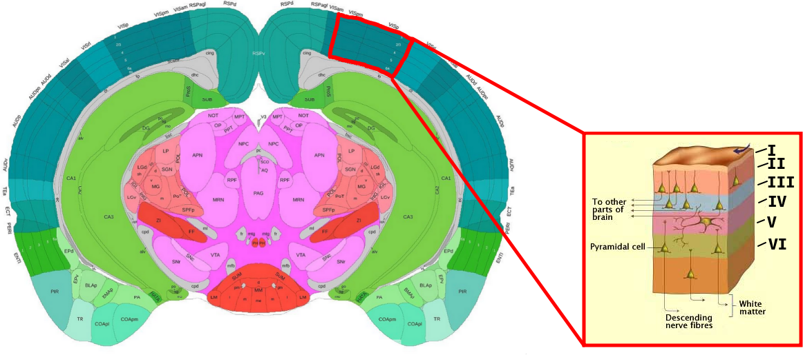

#  Spatial Transcriptomics
***

<br/>

- __*Alma Andersson*__, KTH Royal Institute of Technology, Stockholm, 🇸🇪 Sweden
- __*Åsa Björklund*__, National Bioinformatics Infrastructure (NBIS), 🇸🇪 Sweden

<br/>

### Background

Spatial transcriptomics (ST) allows for visualization and quantitative analysis
of gene expression in tissue sections. There is a multitude of recent methods
for ST, but here we will focus on data from the Visium platform.

Spatial transcriptomics data generated with the Visium platform is in many ways similar to
single cell transcriptomics (SC). It contains UMI counts from about 5-20 cells
per spot (spatial capture location) instead of single cells, meaning that the
expression profile of a spot represents a _mix_ of transcripts originating from
all cells contributing to said spot. Despite several cells contributing to each
spot, ST data - just as SC data - is still quite sparse. The major difference
between SC and Visum data, aside from the latter not operating at single cell
resolution, is that each observation (spot) has spatial information associated
with it, i.e., we know where in the tissue the captured transcripts come from.

As mentioned, there are far more spatial transcriptomics techniques than just
Visium, and new ones are continuously published, hence it's fair to say that
this is a rapidly evolving field. Simultaneous to this introduction of new
experimental techniques, we've seen a surge in new **computational tools** and
methods for analysis of ST data. In this course we aim to make you familiar with
a few of them.

<br/>


### Useful links

* [Tutorials](https://nbisweden.github.io/workshop-scRNAseq/exercises) for analysis of ST data and integration with SC data using Seurat, Scran or Squidpy.
* [Museum of Spatial Transcriptomics](https://pachterlab.github.io/LP_2021/) Extensive overview and lists of tools for Spatial transcriptomics. 
* [OSTA](https://lmweber.org/OSTA-book/index.html) Orchestrating Spatially Resolved Transcriptomics Analysis with Bioconductor

<br/>

### Project topics

Each task will be done in a group of four students, but many of the steps
involves testing different tools or different analysis parameters. So we suggest
that you subdivide the tasks within your group as you see fit.

In both projects we will work with Visium mouse brain sections, but each group
will be focusing on different objectives.

#### Topic 1: Analysis of multiple visium datasets

[Project plan](topic1)

In this project you will work with mouse brain sections from [Kleshchevnikov et al.](https://www.biorxiv.org/content/10.1101/2020.11.15.378125v1) which can be downloaded
[here](https://cell2location.cog.sanger.ac.uk/tutorial/mouse_brain_visium_wo_cloupe_data.zip)
or using `wget`:

```bash
wget https://cell2location.cog.sanger.ac.uk/tutorial/mouse_brain_visium_wo_cloupe_data.zip
```
alternatively `curl` :

```bash
curl https://cell2location.cog.sanger.ac.uk/tutorial/mouse_brain_visium_wo_cloupe_data.zip -O mouse_brain_visium_wo_cloupe_data.zip
```

#### Topic 2: Annotating celltypes in visium data using single cell data

[Project plan](topic2)

In this project you will focus on the integration of single cell data with
spatial data from the [primary visual
cortex](https://en.wikipedia.org/wiki/Visual_cortex#Primary_visual_cortex_(V1))
(VISp) region, a well-studied part of the cortex. What makes this structure
interesting to study from a spatial perspective is that it exhibits a form of
_layering_ where different types of neurons are arranged in six laminar layers
(Layer I to VI), see image below:



If your are unfamiliar with the mouse brain or just want some guidance when
orienting your tissues, we highly recommend the Allen Brain Atlas' interactive
reference, which you may find
<a href="https://atlas.brain-map.org/atlas?atlas=602630314#atlas=602630314&plate=576987171&structure=593&x=7641.83349609375&y=3001.0000610351562&zoom=-3&resolution=10.00&z=3" target="_blank">here</a>.

The single cell data we'll be using was originally published by [Tasic et al.](https://www.nature.com/articles/s41586-018-0654-5) and can be accessed
[here](https://www.ncbi.nlm.nih.gov/geo/query/acc.cgi?acc=GSE115746). In order
to save you some time, we've generated a "ready-to-use" `h5ad` file for you, containing both the count and meta data,
which you can download [here](https://kth.box.com/s/9l17vxj9y0jk3gi35cbgug78n1ckat2p). If you are interested, the script we used to
create this `h5ad` file is located in `scripts/sc_make_h5ad.py`. `h5ad` files can
easily be loaded in `python` using the `anndata` or `scanpy` packages, there's
also support for these files in `R` for example using the `readH5AD` function
from the `zellkonverter` package.

### Practical information

We have provided conda recipies for some of the most common tools that you may
want to use in the projects in this
[folder](https://github.com/NBISweden/single-cell_sib_scilifelab_2021/tree/main/project_spatial/conda/)

If you are not familiar with conda, please have a look at the
[Precourse_material](../precourse). There are separate environments for `R` and
`python`, where we suggest you use whatever language you feel most comfortable
with; please note that you do not have to limit yourself to one language per
group, in fact it's a good exercise to try to coordinate data and results
between different suites and languages.

Please refer to our [Tips and tricks](tips) where we try to list common issues
with some of the most common tools.

<br/>


