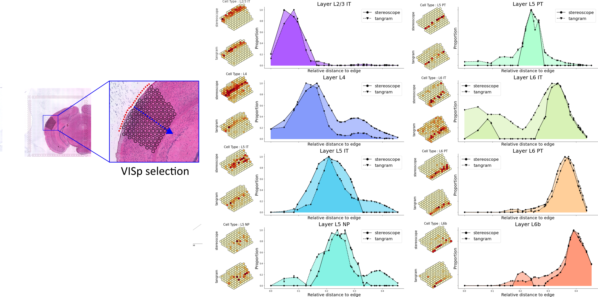

#  Spatial Transcriptomics
***

<br/>

- __*Alma Andersson*__, KTH Royal Institute of Technology, Stockholm, 🇸🇪 Sweden
- __*Åsa Björklund*__, National Bioinformatics Infrastructure (NBIS), 🇸🇪 Sweden

<br/>

### Background

Spatial transcriptomics (ST) allows for visualization and quantitative analysis
of gene expression in tissue sections. There is a multitude of recent methods
for ST, but here we will focus on data from the Visium platform.

Spatial transcriptomics data generated with the Visium platform is in many ways similar to
single cell transcriptomics (SC). It contains UMI counts from about 5-20 cells
per spot (spatial capture location) instead of single cells, meaning that the
expression profile of a spot represents a _mix_ of transcripts originating from
all cells contributing to said spot. Despite several cells contributing to each
spot, ST data - just as SC data - is still quite sparse. The major difference
between SC and Visum data, aside from the latter not operating at single cell
resolution, data is that each observation (spot) has spatial information associated
with it, i.e., we know where in the tissue the captured transcripts come from.

As mentioned, there are far more spatial transcriptomics techniques than just
Visium, and new ones are continuously published, hence it's fair to say that
this is a rapidly evolving field. Simultaneous to this introduction of new
experimental techniques, we've seen a surge in new computational tools and
methods for analysis of ST data. In this course we aim to make you familiar with
a few of them.

<br/>


### Useful links

* [Tutorials](https://nbisweden.github.io/workshop-scRNAseq/exercises) for analysis of ST data and integration with SC data using Seurat, Scran or Squidpy.
* [Museum of Spatial Transcriptomics](https://pachterlab.github.io/LP_2021/) Extensive overview and lists of tools for Spatial transcriptomics. 


<br/>

### Project topics

Each task will be done in a group of four students, but many of the steps
involves testing different tools or different analysis parameters. So we suggest
that you subdivide the tasks within your group as you see fit.

In both projects we will work with Visium mouse brain sections, but each group
will be focusing on different objectives.

#### Topic 1: Analysis of multiple visium datasets

In this project you will work with mouse brain sections from [Kleshchevnikov et al.](https://www.biorxiv.org/content/10.1101/2020.11.15.378125v1) which can be downloaded
[here](https://cell2location.cog.sanger.ac.uk/tutorial/mouse_brain_visium_wo_cloupe_data.zip)
or using `wget`:

```bash
wget https://cell2location.cog.sanger.ac.uk/tutorial/mouse_brain_visium_wo_cloupe_data.zip
```
alternatively `curl` :

```bash
curl https://cell2location.cog.sanger.ac.uk/tutorial/mouse_brain_visium_wo_cloupe_data.zip -O mouse_brain_visium_wo_cloupe_data.zip
```

#### Topic 2: Annotating celltypes in visium data using single cell data

In this project you will focus on the integration of single cell data with spatial data in the Visceral cortex  which can be downloaded [here](fill in link).  


### Practical information

We have provided conda recipies for some of the most common tools that you may
want to use in the projects in this
[folder](https://github.com/NBISweden/single-cell_sib_scilifelab_2021/tree/main/project_spatial/conda/)

If you are not familiar with conda, please have a look at the
[Precourse_material](../precourse). There are separate environments for `R` and
`python`, where we suggest you use whatever language you feel most comfortable
with; please note that you do not have to limit yourself to one language per
group, in fact it's a good exercise to try to coordinate data and results
between different suites and languages.

Please refer to our [Tips and tricks](tips) where we try to list common issues
with some of the most common tools.

<br/>

###  Milestone 0: Spatial tutorials 

Start by having a look at the
[Tutorials](https://nbisweden.github.io/workshop-scRNAseq/exercises) for
analysis of ST data and integration with SC data using Seurat, Scran or Squidpy.

Select wichever pipeline you feel is most relevant for you to use.


###  Milestone 1: Load data 

1.1. Load the relevant ST data for your project into the data object of your choice (AnnData, SeuratObject, SCE etc.).

1.2. Have a look at the object and describe in your report briefly what the different slots of the objects are.

1.3 (Task 1) Concatenate the different sections into one object if relevant for that data type.

<br/>

###  Milestone 2: Quality control 

2.1 Calculate quality metrics such as number of genes, UMIs, and mitochondrial reads per spot.

2.2 Visualize the QC stats on a per spot basis, do you see even distribution across spots/sections?

2.3 Possibly filter out low quality spots, discuss with your group and motivate how the data should be filtered. 

2.4 Filter genes, we suggest to always remove mitochondrial genes, but possibly also other problematic genes (e.g., ribosomal and Hb-genes).

<br/>

###  Milestone 3: Dimensionality reduction and clustering 

3.1 Select a relevant set of genes for dimensionality reduction, motivate why you think this is a relevant choice.

3.2 Start with PCA and make a reasonable selection of number of principal components.

3.3 Run a graph based dimensionality reduction, like UMAP or another method of choice.

3.4 Cluster the spots with your method of choice, motivate why you are using that method.

<br/>


###  Milestone 4 (Task 1): Integration 

4.1 Look at the dimensionality reduction and clustering in step 3. Do you see any batch effects? What would be the best way to remove that effect do you think?

4.2 Select integration features, how is this done best do you think? Discuss with your group and test a few different methods.

4.3 Select a method for integration. A good idea is that everyone in the group
tests different tools and then you compare the results, here it's also fit to
discuss what _metrics_ that should be used to gauge "performance" of each
method, i.e., how do you quantitatively measure how well the data has been integrated?

4.4 Rerun clustering and dimensionality reduction in the integrated space.

4.5 Evaluate the integration, is there still some batch effects visible or are
you happy with the results? It may be important to go back and tweak gene
selection, number of components etc in the integration util you are happy with
the results.

<br/>

###  Milestone 4 (Task 2): Subset the section 

4.1 Identify the area of interest (VISp) region and create a new object with
only the selected region.

4.2 Visualize the region

4.3 Rerun dimensionality reduction and clustering with the selected region.

<br/>

###  Milestone 5 (Task 1): Cluster sections individually 

5.1 Instead of working with all sections combined, instead run the analysis one section at a time.

5.2 How well does the clustering on section level agree with the clustering after integration? If they do not agree, how can you explain the differences?


###  Milestone 5 (Task 2): Load SC data 

5.1 Perform clustering and QC of the data and compare to the annotations provided by the paper.

5.2 Perform Differential Expression analysis, this may be a relevant gene set to use for aligning the SC data to the ST data.

<br/>

###  Milestone 6 (Task 1): Image features 

6.1 Use a tool that can calculate image features

6.2 Use the image features to cluster the sections. How does it compare to the expression based clusters?

6.3 Do you see more/less batch effects in clustering based on image features? What could the reasons be?

<br/>

###  Milestone 6 (Task 2): Integrate or deconvolve 

6.1 Look at existing methods for aligning SC and ST data and select a few that you think are relavant. Discuss with the group what to select and why. 

6.2 Select features for integration/deconvolution, this can be done using variable genes in SC data only, both datasets or DEGs from SC data. Discuss what you think is the best method to use and possibly try out a few different ones if time allows.

6.3 Run the methods you selected.

6.4 Compare the results, what are main similiarities/differeces between the tools?

<br/>

### Bonus tasks:

If time allows we have listed a few additional things you could try out if time allows.

* Image segmentation, can you use the information on number of cells per spot to enhance the deconvolution/clustering?
* If you've integrated the single cell data with your spatial data, you will
  notice that some of the cell types (named Layer X) are arranged in a
  sequential manner as you move from the outer edge of the cortex towards the
  core of the tissue. You could try to visualize how the different cell types
  are distributed along this axis, as in the example below where we've done this
  very exact analysis for the VISp region in a different data set, comparing
  Tangram and _stereoscope_ mappings:<br>
  
* ...

<br/>

