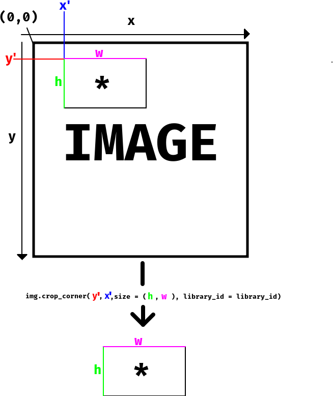

#  Tips for Spatial Transcriptomics projects
***

<br/>

Here, we will try to list some issues, tips related to different programs etc.


## Loading data

### Loading h5ad in R

To convert a scanpy AnnData object to a Seurat object in R, you need to have SeuratDisk installed. It should then be easy to read it in in R, however, it is very sensitive to having the correct formats, naming conventions etc for it to work. So it may at times require some troubleshooting.

Loading the VISp scRNAseq dataset should work with:

```
library(Seurat)
library(SeuratDisk)
library(hdf5r)

Convert("VISp-sc_data.h5ad", dest = "h5seurat", overwrite = TRUE)
data <- LoadH5Seurat("VISp-sc_data.h5seurat")

```


## Scanpy hints

### Loading data

A good idea is to specify `library_id` when you load visium data so that you have easy to interpret names of your images that matches `library_id` in the metadata (`adata.obs`):

```
adata = sc.read_visium("../data/mouse_brain_visium_wo_cloupe_data/rawdata/ST8059049/", library_id = "ST8059049")
```

### Barplots

Matplotlib (https://matplotlib.org/) has some conventient functions for plotting, for instance you can plot sample distribution per cluster with:

```
tmp = pd.crosstab(adata.obs['clusters'],adata.obs['library_id'], normalize='index')
tmp.plot.bar(stacked=True).legend(loc='upper right')
```

### Selection of image region with Napari

Some example code on how to select part of of a section in folder 'notebooks/napari_test.ipynb'

### Reverting back to raw matrix

If you want the full lognormalized (or whatever you stored in adata.raw) matrix again:

`adata = adata.raw.to_adata()`


### Convert from dense to sparse and back

Some packages may require the matrices to be in a specific format, and hence will not run if you have a dense/sparse matrix, but it is easy to convert them.

Sparse to dense:

`adata.X.todense()`

Dense to sparse (you can use either csr or rsc (column to row or row to column)

```
from scipy.sparse import csr_matrix
adata.X = csr_matrix(adata.X)
```
### Cropping data with squidpy

If we have an image contained within an `ImageContainer` object called `img` in
`squidpy`, we can crop this image by using the function `crop_corner` (there are
other methods as well). You can read the documentation for this function
[here](https://squidpy.readthedocs.io/en/latest/classes/squidpy.im.ImageContainer.crop_corner.html#squidpy.im.ImageContainer.crop_corner),
but in short you use the following command to crop your image:

```python
crop = img.crop_corner(y,x,size = (h,w),library_id = library_id)
```
which will give you a new `ImageContainer` object called `crop`. Below we've also
assembled an image that explains how the selection works and how the different
parameters (`y`,`x`,`h` and `w`) relates to the original and cropped image. 




### Running tangram, nuclei segmentation and image features:

* Some example code on how to run tangram in 'notebooks/tangram_test.ipynb'
* Some example code on how to run nuceli segmentation and then tangram, and also calculate image features, in 'notebooks/tangram_test_segmentation.ipynb'

### Selection of image region with Napari

Some example code on how to select part of of a section in folder 'notebooks/napari_test.ipynb'
