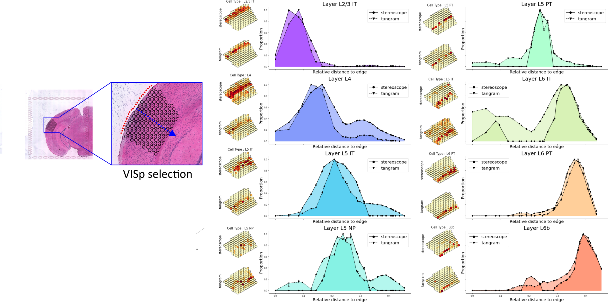

#  Spatial Transcriptomics - Topic2
***

 

###  Milestone 0: Spatial tutorials

Start by having a look at the
[Tutorials](https://nbisweden.github.io/workshop-scRNAseq/exercises) for
analysis of ST data and integration with SC data using Seurat, Scran or Squidpy.

Select wichever pipeline you feel is most relevant for you to use.

###  Milestone 1: Load data

1.1. Load the relevant ST data for your project into the data object of your choice (AnnData, SeuratObject, SCE etc.).

1.2. Have a look at the object and describe in your report briefly what the different slots of the objects are.

1.3  Concatenate the different sections into one object if relevant for that data type.

 

###  Milestone 2: Quality control

2.1 Calculate quality metrics such as number of genes, UMIs, and mitochondrial reads per spot.

2.2 Visualize the QC stats on a per spot basis, do you see even distribution across spots/sections?

2.3 Possibly filter out low quality spots, discuss with your group and motivate how the data should be filtered.

2.4 Filter genes, we suggest to always remove mitochondrial genes, but possibly also other problematic genes (e.g., ribosomal and Hb-genes).

 

###  Milestone 3: Dimensionality reduction and clustering

3.1 Select a relevant set of genes for dimensionality reduction, motivate why you think this is a relevant choice.

3.2 Start with PCA and make a reasonable selection of number of principal components.

3.3 Run a graph based dimensionality reduction, like UMAP or another method of choice.

3.4 Cluster the spots with your method of choice, motivate why you are using that method.

 

###  Milestone 4: Subset the section

4.1 Identify the area of interest (VISp) region and create a new object with
only the selected region from 2 sections of your choice. Discuss with your group what region to select so that everyone uses the same.

4.2 Visualize the region

4.3 Rerun dimensionality reduction and clustering with the selected region. Does it change the clustering to what you had with the full dataset? Discuss why.

 

###  Milestone 5: Load SC data

5.1 Perform clustering and QC of the data and compare to the annotations provided by the paper. Does it agree well do you think?

5.2 Perform Differential Expression analysis, this may be a relevant gene set to use for aligning the SC data to the ST data.

 

###  Milestone 6: Integrate or deconvolve

6.1 Look at existing methods for aligning SC and ST data and select a few that you think are relavant. Discuss with the group what to select and why.

6.2 Select features for integration/deconvolution, this can be done using variable genes in SC data only, both datasets or DEGs from SC data. Discuss what you think is the best method to use and possibly try out a few different ones if time allows.

6.3 Run the methods you selected.

6.4 Compare the results, what are main similiarities/differeces between the tools?

 

### Bonus tasks:

If time allows we have listed a few additional things you could try out if time allows.

* Nuclei segmentation, can you use the information on number of cells per spot to enhance the deconvolution?
* If you've integrated the single cell data with your spatial data, you will
  notice that some of the cell types (named Layer X) are arranged in a
  sequential manner as you move from the outer edge of the cortex towards the
  core of the tissue. You could try to visualize how the different cell types
  are distributed along this axis, as in the example below where we've done this
  very exact analysis for the VISp region in a different data set, comparing
  Tangram and _stereoscope_ mappings: 
  
* ...