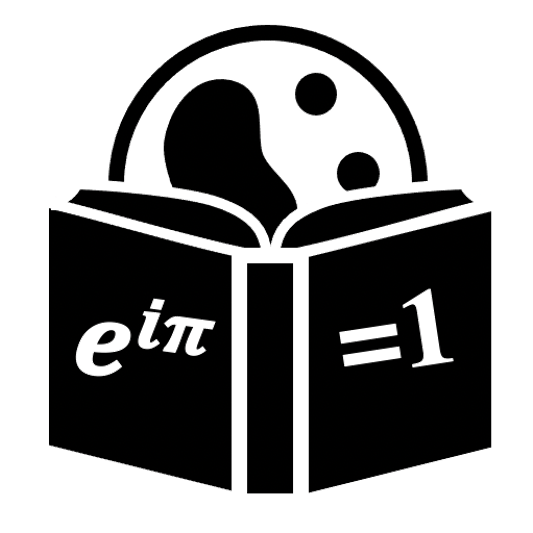

#  Projects

***

 

Since each of the 4 group themes may have completely different softwares, please follow in instructions specific to each one.

  <a href="/single-cell_sib_scilifelab_2021/project_spatial/README.html">
  

   
  Spatial transcriptomics
  

  </a>

  <a href="/single-cell_sib_scilifelab_2021/project_velocity/README.html">
  

   
  RNA velocity
  

  </a>

  <a href="/single-cell_sib_scilifelab_2021/project_omics/README.html">
  

   
  Omics integration
  

  </a>

  <a href="/single-cell_sib_scilifelab_2021/project_dnn/README.html">
  

   
  Deep learning
  

  </a>

 

***

###  Learning strategy

The proposed educational plan for this course will be done using the Project-Based Learning (PBL) approach. This way, rather than having lectures on a topic and defined set of instructions and pre-given steps to follow (which focus on passive individual learning), you are required to learn the topic in a more **active** and **dynamic** way in order to solve the data analysis tasks as a group. <!--Therefore, each group is provided with: -->

<!-- 1. The [report file](project_velocity/README.md) containing a list of instructions and questions giving the overall direction and order of the steps needed to be done (read below how to use it). -->
<!-- 2. A [glossary of terms](single_cell/glossary/glossary_of_terms_single_cell.html) which contains detailed information about many of the steps and provides further references on the topics. -->

 

***

###  How to work in groups

Each group is required to gather information from <!-- the **glossary** or from--> other **sources** to perform single cell data analysis by filling the report file (using this [project_report.Rmd](single_cell/code/project_report.Rmd) file), by:

1. Reading the instructions/questions on the **project report** for a certain task.
2. Searching <!--the **glossary** or--> **other sources** for guidance.
3. Discussing with your colleges which step needs to be done or included.
4. Dividing tasks among your group colleagues (each one can test parts of the code and then send the result to the one responsible for the report).
5. Replacing the instructions with a text explaining the rationale for this step.
6. Adding and running code from that step.

You are encouraged to use any other additional website / article in your report. That also includes addition of other previous experiences and/or additional code steps from other sources, as long as the rationale for the inclusion is also discussed in the report text. You can also add any other plots and visualisations in your report to illustrate your results.

We recommend to save the last 1 hour available to work on the project presentations. To save time, please create a google-slide presentation and divide the tasks, so everyone can contribute to building the presentation simultaneously.

 

***

###  Tips for a good group dynamic

Working in groups is not a simple task, but it is how science is built. The main goal of working in groups is to teach and learn with others. Be kind and patient with your colleagues, help each other so the group reaches a good and fluent dynamic. However, time to work on the project is restricted, so please focus on the tasks at hand and be clear and concise as possible when communicating. Remember: this is a group work and you are evaluated as a group player.

Here we have some tips for successfully structuring your project work:

1. The group votes one person to GUIDE the group (the most experienced is preferable). The GUIDE's functions are:
  - To keep the pace of the tasks in hand.
  - Distribute the tasks to the other group members
  - Gather results from the group members to assemble the project report.
2. Then, help each other to startup `jupyter notebook`/`Rmarkdown`, then copy the project report instructions into it.
3. Once everyone is set, the GUIDE reads the first milestone instructions out loud to the group.
4. The group then discuss what needs to be done. It is worth dividing the tasks, and the GUIDE can divide.
  - Example: When asked `which dimensionality reduction to use?`, each person finds out how to run 1 different dimensionality reduction and then **send the code and explanation to the GUIDE**, so he can paste into the report.
  - Example: When asked `which metric is best to evaluate a method?`, each person chooses 1 different technique and then **send the code and explanation to the GUIDE**, so he can paste into the report.
  - In some cases, there might be many options to choose from, so need to prioritise what to focus on.
  - If something goes wrong or is not working, ask for help from your colleagues
  - You are free to discuss in the group to skip some parts for the sake time (maybe the group tested enough for that task)
  - The GUIDE can abstain from doing this part and focus on the report, if necessary.
5. If you are done before others, you can now let the group know you are done and:
  - help your colleagues by discussing their issues
  - trying to run the code from your colleague
  - run an optional task that no one is yet running
  - help the GUIDE in writing and/or polish the report text/code
  - write code to illustrate the results and/or compare results
6. Once the task is completed and attached to the report, the GUIDE can share the updated report with the group.
7. By the end of each group session, it is beneficial that group has the latest version of the report, so you can always start from the last step.

 

***
